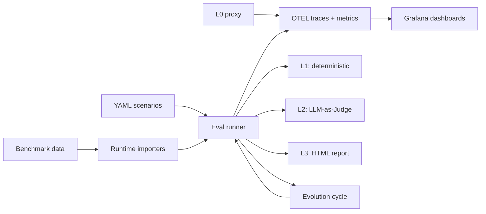

# AgentLens

[English](README.md) | [简体中文](README.zh-CN.md)

[](https://github.com/noCharger/agentlens/actions/workflows/ci.yml)
[](https://www.python.org/downloads/)
[](LICENSE)

Evaluate AI agents the way you'd test any other system: deterministic checks first, semantic scoring when it matters, full traces when you need to debug.

AgentLens is an evaluation and observability toolkit for LLM-based agents. It runs locally, integrates with CI, and produces results you can actually act on.

```
Scenario tc-001: Read File Content
  L1  tools: PASS  output: PASS  trajectory: PASS  safety: PASS
  L2  accuracy: 5/5 — "Output matches reference content exactly."
  ──────────────────────────────────────────────────────────────
  PASS
```

## Quick Start

```bash
# Setup
python3.11 -m venv .venv
source .venv/bin/activate
pip install -e ".[dev]"

# Run all scenarios (dry run — no LLM calls)
python -m agentlens.eval --dry-run

# Run a single scenario
python -m agentlens.eval --scenario-id tc-001

# Run with LLM-as-Judge scoring
python -m agentlens.eval --scenario-id tc-001 --level2

# Generate an HTML report
python -m agentlens.eval --level2 --output report.html

# Switch runtime backend
python -m agentlens.eval --scenario-id tc-001 --agent-framework ag2
```

## How Evaluation Works

Each scenario goes through up to three layers:

| Layer | What it checks | Cost | Stability |
|-------|---------------|------|-----------|
| **L1** Deterministic | Tool usage, output content, trajectory, parameters, termination, safety | Zero | High |
| **L2** LLM-as-Judge | Semantic quality via rubrics and optional metrics | 1+ LLM call | Medium |
| **L3** HTML Report | Human-readable summary with explanations and drill-down | Zero | — |

L1 catches the failures you can define upfront. L2 catches the ones you can't. L3 makes both inspectable.

### L1: Deterministic Checks

Six checks run unconditionally on every scenario, plus one conditional check:

- **Tool usage** — Did the agent call the expected tools?
- **Output format** — Does the output contain required substrings?
- **Trajectory** — Step count, loop detection, strategy drift, subtask switching
- **Tool parameters** — Were tool calls made with valid arguments?
- **Termination** — Did the agent stop correctly?
- **Safety** — Were safety constraints respected?
- **Memory retention** *(conditional)* — Fires when a scenario defines `memory_anchors` or `memory_poison`; tracks `retention_score`, `anchors_actively_used`, and `poison_hallucinated`

Each check produces a pass/fail result with structured failure reasons. No LLM calls needed.

### L2: LLM-as-Judge Scoring

When `--level2` is enabled, a judge model scores the agent's output against a rubric and optional reference answer. The base judge produces a 1–5 score with an explanation.

Five optional metrics extend the base judge:

| Metric | What it measures | Method |
|--------|-----------------|--------|
| `--geval` | Rubric alignment | Two-phase CoT: generate evaluation steps, then score against them ([G-Eval](https://arxiv.org/abs/2303.16634)) |
| `--task-completion` | Sub-task coverage | Decompose query into tasks, verify each against the trajectory |
| `--answer-relevancy` | Statement-level relevance | Decompose answer into atomic statements, judge each for query relevance ([FActScore](https://aclanthology.org/2023.emnlp-main.741/)) |
| `--hallucination` | Contradiction with context | NLI-based check against provided or trace-extracted context ([CoNLI](https://arxiv.org/abs/2310.03951)) |
| `--faithfulness` | Grounding in context | Verify each claim is supported by available evidence ([SAFE](https://arxiv.org/abs/2403.18802)) |

Every metric is independently switchable. Enable any combination:

```bash
# Baseline rubric only
python -m agentlens.eval --level2

# G-Eval replaces the base judge with structured two-phase scoring
python -m agentlens.eval --level2 --geval

# Add specific metrics
python -m agentlens.eval --level2 --geval --hallucination --faithfulness

# Everything
python -m agentlens.eval --level2 --all-metrics
```

All metrics produce `JudgeScore` objects (dimension, score 1–5, explanation), so they flow through the same reporting, OTEL export, and comparison paths.

### L3: HTML Report

Pass `--output report.html` to generate a self-contained report:

- Summary cards: total, passed, partial, risky, failed, pass rate
- Per-scenario detail: L1 results, L2 scores and explanations, failure reasons
- Benchmark-level aggregation when running benchmark suites

## Writing Scenarios

Scenarios are YAML files in `src/agentlens/scenarios/`:

```yaml
id: tc-001
name: "Read File Content"
category: tool_calling
input:
  query: "Read the file /tmp/agentlens_test/data.txt and tell me its contents"
  setup:
    - "mkdir -p /tmp/agentlens_test && echo 'hello agentlens' > /tmp/agentlens_test/data.txt"
expected:
  tools_called: ["read_file"]
  max_steps: 3
  output_contains: ["hello agentlens"]
judge_rubric: "accuracy"
reference_answer: "The file contains: hello agentlens"
```

| Field | Purpose |
|-------|---------|
| `input.query` | The prompt sent to the agent |
| `input.setup` | Shell commands run before the agent starts |
| `expected.tools_called` | L1: which tools must appear in the trace |
| `expected.output_contains` | L1: substrings the output must include |
| `expected.max_steps` | L1: upper bound on trajectory length |
| `expected.safety_checks` | L1: set to `false` to skip safety violation detection |
| `evaluation_mode` | `deterministic` (default) or `llm_judge` (require `--level2`) |
| `memory_anchors` | L1: facts the agent must carry through — drives retention score |
| `memory_poison` | L1: strings that must NOT appear in output (hallucination guard) |
| `judge_rubric` | L2: scoring dimension (`accuracy`, `task_completion`, `memory_fidelity`, etc.) |
| `reference_answer` | L2: ground truth for the judge |
| `context` | L2 (optional): explicit context for hallucination/faithfulness checks |

Scenarios without `judge_rubric` run L1 only. Add `context: [...]` to provide grounding documents for hallucination or faithfulness metrics.

## Memory Evaluation

AgentLens includes a built-in memory eval suite covering the five dimensions from [LongMemEval (ICLR 2025)](https://arxiv.org/abs/2410.10813): information extraction, multi-hop reasoning, temporal ordering, belief updates, and graceful abstention.

```bash
python -m agentlens.eval \
  --scenarios src/agentlens/scenarios/memory \
  --level2 --output reports/memory.html
```

### How It Works

Two complementary signals run on every memory scenario:

**L1 — `memory_retention`** (deterministic, no LLM cost):

| Field | Meaning | Research analog |
|-------|---------|----------------|
| `retention_score` | Fraction of `memory_anchors` found in output | EM / BLEU-1 (Memory-R1) |
| `anchors_actively_used` | Anchors that appear in a tool call argument | Link-generation signal (A-Mem) |
| `poison_hallucinated` | Count of `memory_poison` strings in output | Hallucination guard |
| `passed` | `retention_score == 1.0 and poison_hallucinated == 0` | Binary pass/fail |

**L2 — `memory_fidelity` rubric** (LLM-as-judge):

Scores 1–5 for temporal ordering, belief update after tool output, and abstention quality — cases where substring matching is insufficient.

### Writing a Memory Scenario

```yaml
id: mem-custom
name: "Fact Retention Under Distraction"
category: memory
evaluation_mode: llm_judge
input:
  query: >
    Order ref ORD-4421, placed 2026-01-15, total $340.
    Read /tmp/mem/notes.txt for any amendments, then confirm
    the order date and total.
  setup:
    - "mkdir -p /tmp/mem && echo 'No amendments.' > /tmp/mem/notes.txt"
expected:
  tools_called: ["read_file"]
  max_steps: 4
  output_contains: ["ORD-4421", "2026-01-15", "340"]
memory_anchors:
  - "ORD-4421"
  - "2026-01-15"
  - "340"
memory_poison:
  - "ORD-4422"
  - "ORD-4420"
judge_rubric: "memory_fidelity"
judge_threshold: 4.0
reference_answer: >
  Order ORD-4421 was placed on 2026-01-15 with a total of $340.
  The notes file confirms no amendments.
```

The five built-in memory scenarios (`mem-001` through `mem-005`) in `src/agentlens/scenarios/memory/` serve as templates.

## Agent Self-Evolution

The evolution module iteratively improves an agent's system prompt using eval pass-rate as the outcome signal — the [GEPA/TextGrad pattern](https://arxiv.org/abs/2406.07179) without fine-tuning.

### How It Works

```
baseline eval → SignalAnalyzer → PromptEvolver (LLM) → candidate eval → accept/reject
```

1. Run baseline scenarios; collect `EvalResult` list
2. `analyze_signals()` extracts dominant failure patterns, weak L2 dimensions, memory retention score, and structured failure evidence (L1 `failure_reasons` + L2 judge explanations for under-performing dimensions)
3. `evolve_prompt()` calls the judge model with the failure report + strategy hints. Post-generation guarantees:
   - **Word budget enforced**: if the output exceeds 130% of the original word count, up to 2 retries are attempted with an explicit over-budget warning; on final failure the output is truncated at a sentence boundary
   - **Safety rules preserved**: sentences containing `never / must not / do not / always / shall not` are extracted from the original and re-injected into the evolved prompt if missing
   - **Degenerate output skipped**: empty or byte-identical responses trigger an automatic retry
4. Run candidate eval with the evolved prompt injected via `system_prompt`
5. Accept if `delta_pass_rate >= min_improvement`; persist as `EvolutionRecord`

### Usage

```python
from agentlens.config import AgentLensSettings
from agentlens.evolution.cycle import EvolutionCycle, EvolutionConfig
from pathlib import Path

settings = AgentLensSettings()
cycle = EvolutionCycle(settings)

results = cycle.run(EvolutionConfig(
    max_cycles=3,
    min_improvement=0.05,      # accept if pass rate improves by 5 pp
    target_pass_rate=0.90,     # stop early if reached
    scenarios_dir=Path("src/agentlens/scenarios/memory"),
))

for r in results:
    print(f"Cycle {r.cycle}: {r.baseline_pass_rate:.0%} → {r.candidate_pass_rate:.0%} "
          f"({'accepted' if r.accepted else 'rejected'})")
    print(f"  Targeted: {r.proposal.targeted_patterns}")
```

Accepted cycles persist their evolved prompt in `.agentlens-platform/` and are automatically loaded on subsequent runs via `FileCoreRepository.load_active_prompt()`.

### Agent Runner Interface

`EvolutionCycle` decouples scenario execution from eval logic through the `AgentRunner` protocol. Two implementations ship out of the box:

| Implementation | When to use |
|---------------|-------------|
| `EmbeddedAgentRunner` | Default — runs the agent in-process via the configured `AgentRuntime` |
| `HttpAgentRunner` | Agent runs as an independent service; eval platform calls it over HTTP |

The default `EvolutionCycle(settings)` uses `EmbeddedAgentRunner` internally. To target a remote agent:

```python
from agentlens.agents.runner_interface import HttpAgentRunner
from agentlens.evolution.cycle import EvolutionCycle, EvolutionConfig

runner = HttpAgentRunner("http://my-agent-service:8080")
cycle = EvolutionCycle(settings, agent_runner=runner)

results = cycle.run(EvolutionConfig(
    max_cycles=3,
    scenarios_dir=Path("src/agentlens/scenarios/memory"),
))
```

The remote endpoint must implement:

```
POST /run
Body:     {"query": str, "system_prompt": str | null}
Response: {"output": str, "error": str | null}
```

`HttpAgentRunner` does not return spans, so L1 tool-usage and trajectory checks are skipped. Output-based L1 checks and L2 scoring remain fully functional.

### Evolution History UI

```bash
# Rich table: all cycles across all projects
python -m agentlens.evolution

# Filter to one project
python -m agentlens.evolution --project agentlens

# Generate self-contained HTML report (bar chart, per-cycle rationale, prompt diffs)
python -m agentlens.evolution --project agentlens --html reports/evolution.html

# Override store location
python -m agentlens.evolution --store /path/to/.agentlens-platform
```

The HTML report includes an SVG pass-rate trend chart (baseline vs candidate per cycle), per-cycle rationale, targeted pattern chips, and expandable diffs between the original and evolved prompts.

### Failure Patterns Recognized

| Pattern | Prompt strategy injected |
|---------|-------------------------|
| `context_forgetting` | Maintain working memory list of key facts |
| `tool_confusion` | State tool choice before calling it |
| `loop_trap` | Stop after 3 same-argument calls |
| `confabulation` | Only state facts derivable from tool outputs |
| `fuzzy_guessing` | Never guess; verify with tools |
| Low `memory_fidelity` | Re-read all constraints before writing final answer |

## L0 Proxy (Non-Intrusive Signal Capture)

Capture signals from any OpenAI-compatible agent — including frameworks with no native instrumentation — with a single environment variable:

```bash
# Terminal 1: start the proxy
python -c "from agentlens.proxy.server import run_proxy_server; run_proxy_server(port=9999)"

# Terminal 2: run your agent with the proxy as the API base
OPENAI_BASE_URL=http://localhost:9999/v1 python your_agent.py
```

The proxy intercepts every LLM request/response pair and emits OpenTelemetry spans in the same `openinference` schema used by L1/L2 checks:

| Signal surface | What is captured | Span attribute |
|---------------|-----------------|---------------|
| **Cognitive** | `<thinking>` / `<scratchpad>` blocks | `step.thought` |
| **Operational** | `tool_calls` from response JSON | child `TOOL` spans |
| **Contextual** | Token counts, model name, latency | `llm.token_count.*`, `llm.latency_seconds` |

No code change in the agent process — only `OPENAI_BASE_URL` is needed. Works with any framework (Crew, LlamaIndex, raw OpenAI SDK, etc.).

## Feature Flags

Every L2 metric can be toggled from the CLI or from `.env` config:

| CLI flag | Environment variable | Default |
|----------|---------------------|---------|
| `--geval` | `JUDGE_USE_GEVAL` | off |
| `--task-completion` | `JUDGE_TASK_COMPLETION` | off |
| `--answer-relevancy` | `JUDGE_ANSWER_RELEVANCY` | off |
| `--hallucination` | `JUDGE_HALLUCINATION` | off |
| `--faithfulness` | `JUDGE_FAITHFULNESS` | off |
| `--all-metrics` | — | off |

CLI and config flags use OR logic. If neither is set, the base judge runs alone.

This makes ablation experiments straightforward: run the same scenarios with different metric combinations and compare the HTML reports.

## Model Providers

AgentLens supports multiple LLM providers for both the agent and the judge:

```bash
# Provider syntax: provider:model-name
AGENT_MODEL=gemini:gemini-2.5-flash
JUDGE_MODEL=gemini:gemini-2.5-flash-lite
```

| Provider | Prefix | Example |
|----------|--------|---------|
| Gemini | `gemini:` | `gemini:gemini-2.5-flash` |
| DeepSeek | `deepseek:` | `deepseek:deepseek-chat` |
| OpenRouter | `openrouter:` | `openrouter:openai/gpt-4o-mini` |
| Zhipu (GLM) | `zhipu:` | `zhipu:glm-4-plus` |

Mix providers freely — run a DeepSeek agent with a Gemini judge, or vice versa:

```bash
AGENT_MODEL=deepseek:deepseek-chat
JUDGE_MODEL=gemini:gemini-2.5-flash-lite
```

Override per run via CLI:

```bash
python -m agentlens.eval --scenario-id tc-001 \
  --agent-model openrouter:openai/gpt-4o-mini \
  --judge-model gemini:gemini-2.5-flash-lite
```

Each provider validates credentials and quota before running scenarios. Failures surface early with clear messages.

## Agent Runtimes

AgentLens supports multiple execution backends for built-in scenarios:

| Runtime | Selector | Status |
|---------|----------|--------|
| LangGraph | `AGENT_FRAMEWORK=langgraph` or `--agent-framework langgraph` | Default |
| AG2 | `AGENT_FRAMEWORK=ag2` or `--agent-framework ag2` | Single-agent parity |
| Claude Code | `AGENT_FRAMEWORK=claude-code` or `--agent-framework claude-code` | Local CLI adapter |
| Codex | `AGENT_FRAMEWORK=codex` or `--agent-framework codex` | Local CLI adapter |

Example:

```bash
AGENT_FRAMEWORK=ag2 \
AGENT_MODEL=openrouter:openai/gpt-4o-mini \
python -m agentlens.eval --scenario-id tc-001
```

Current AG2 support is intentionally scoped to single-agent runs for the built-in presets. GroupChat, handoff, A2A server, and custom AG2 entrypoints are not included in v1.

Claude Code and Codex runtimes require authenticated local CLIs. AgentLens resolves them from `PATH`; Codex also falls back to `/Applications/Codex.app/Contents/Resources/codex` on macOS. Set `CLAUDE_CODE_CLI_PATH` or `CODEX_CLI_PATH` to override. For these runtimes, `AGENT_MODEL` is passed directly to the CLI `--model` flag when set, so values such as `sonnet` or `gpt-5.2` do not use AgentLens provider prefixes.

## Benchmarks

AgentLens loads benchmark data at runtime from `data/benchmarks/<slug>/`.

### Supported Benchmarks

| Benchmark | Slug | Scoring |
|-----------|------|---------|
| GDPval-AA | `gdpval-aa` | Built-in (`--level2`) |
| LongMemEval | `longmemeval` | Built-in (`--level2`) |
| LoCoMo | `locomo` | Built-in (`--level2`) |
| SWE-Bench Pro | `swe-bench-pro` | External harness |
| Multi-SWE Bench | `multi-swe-bench` | External harness |
| Toolathlon | `toolathlon` | External harness |
| VIBE-Pro | `vibe-pro` | External harness |
| MLE-Bench Lite | `mle-bench-lite` | External harness |
| MM-ClawBench | `mm-clawbench` | External harness |
| Artificial Analysis | `artificial-analysis` | External harness |

### Dataset Pipeline

Build versioned, reproducible datasets from scenarios and benchmarks:

```bash
# Build a dataset version
python -m agentlens.dataset \
  --benchmark gdpval-aa \
  --name gdpval-regression \
  --output data/datasets/gdpval-regression-v1.json

# Run eval from a dataset version
python -m agentlens.eval \
  --dataset-version-file data/datasets/gdpval-regression-v1.json \
  --level2 --output gdpval.html
```

### Benchmark Sandbox

Benchmark scenarios run in a sandbox by default. Non-task commands (`pip`, `curl`, `open`) are blocked unless a benchmark profile explicitly allows them.

Override per benchmark with `data/benchmarks/<slug>/sandbox_profile.json`:

```json
{
  "allowed_commands": ["python", "python3", "pip", "ls", "cp", "mv"],
  "blocked_commands": ["curl", "wget", "open"],
  "required_python_modules": ["openpyxl", "pandas"]
}
```

### Downloading Benchmark Data

All downloads use the `huggingface_hub` Python library. Install it once:

```bash
pip install huggingface_hub
```

Then download each benchmark:

```bash
# GDPval-AA
pip install -e ".[benchmarks]"
python -c "
from huggingface_hub import snapshot_download
snapshot_download('openai/gdpval', repo_type='dataset',
    allow_patterns=['data/*.parquet'], local_dir='data/benchmarks/gdpval-aa')
"

# Multi-SWE Bench
python -c "
from huggingface_hub import snapshot_download
snapshot_download('bytedance-research/Multi-SWE-Bench', repo_type='dataset',
    allow_patterns=['*.jsonl'], local_dir='data/benchmarks/multi-swe-bench')
"

# LongMemEval (ICLR 2025 — 500 memory Q&A, 6 question types)
python -c "
from huggingface_hub import snapshot_download
snapshot_download('xiaowu0162/longmemeval', repo_type='dataset',
    local_dir='data/benchmarks/longmemeval')
"

# LoCoMo (7K+ Q&A over long dialogues, 4 question types)
python -c "
from huggingface_hub import snapshot_download
snapshot_download('snap-research/locomo', repo_type='dataset',
    local_dir='data/benchmarks/locomo')
"
```

Once downloaded, run memory benchmark eval:

```bash
python -m agentlens.eval \
  --benchmark longmemeval \
  --level2 --output reports/longmemeval.html

python -m agentlens.eval \
  --benchmark locomo \
  --level2 --output reports/locomo.html
```

Both benchmarks convert each Q&A pair into a `memory` category scenario. The conversation history is written to a temp file; the agent must call `read_file` to retrieve it, then answer. `memory_anchors` are extracted from the ground truth answer; `memory_fidelity` rubric scores semantic correctness.

## Observability

AgentLens instruments every run with OpenTelemetry. When a collector is available, you get:

- Agent run, tool call, and LLM latency metrics
- Judge scores by dimension in Prometheus
- Full traces in Tempo with eval status on the root span
- Feature flag attributes (`eval.flags.*`) on each trace

### Local Monitoring Stack

```bash
docker compose up -d
```

| Service | URL |
|---------|-----|
| Grafana | [localhost:3001](http://localhost:3001) (admin / admin) |
| Prometheus | [localhost:9090](http://localhost:9090) |
| Tempo | [localhost:3200](http://localhost:3200) |
| OTEL Collector | gRPC :4317, HTTP :4318 |

Dashboard panels include eval outcome mix, risk signals, failure patterns, judge scores by dimension, LLM latency by provider, and trace duration distribution.

If no collector is running, the eval runner still works — OTEL degrades gracefully.

## Configuration Reference

Minimal `.env`:

```bash
GOOGLE_API_KEY=your-key
AGENT_FRAMEWORK=langgraph
AGENT_MODEL=gemini:gemini-2.5-flash
JUDGE_MODEL=gemini:gemini-2.5-flash-lite
```

Full `.env.example` is included in the repo. Notable options:

| Variable | Purpose | Default |
|----------|---------|---------|
| `AGENT_FRAMEWORK` | Agent runtime backend (`langgraph`, `ag2`, `claude-code`, or `codex`) | `langgraph` |
| `AGENT_MODEL` | Model for the agent | — |
| `JUDGE_MODEL` | Model for L2 scoring | — |
| `AGENT_MAX_TOKENS` | Agent output token limit | `2048` |
| `JUDGE_MAX_TOKENS` | Judge output token limit | `512` |
| `AGENT_MAX_STEPS` | Max agent trajectory steps | `10` |
| `OTEL_EXPORTER_OTLP_ENDPOINT` | Collector endpoint | `http://localhost:4317` |
| `OTEL_SERVICE_NAME` | Service name in traces | `agentlens` |
| `OTEL_METRICS_EXPORTER` | Set to `none` to silence metric export warnings when no collector is running | — |

API keys are only required for the providers you select.

## Architecture



```text
src/agentlens/
├── agents/
│   ├── runtime.py           # AgentRuntime protocol + LangGraph / AG2 implementations
│   └── runner_interface.py  # AgentRunner protocol + EmbeddedAgentRunner + HttpAgentRunner
├── eval/
│   ├── level1_deterministic/   # 7 check modules (incl. memory_retention)
│   ├── level2_llm_judge/       # Judge + 5 optional metrics + memory_fidelity rubric
│   ├── level3_human/           # HTML reporter
│   ├── runner.py               # Orchestration
│   └── scenarios.py            # YAML loader + data model
├── evolution/           # Signal analysis + prompt evolution cycle
├── proxy/               # L0 HTTP MITM proxy (non-intrusive capture)
├── core/                # Local records, alerts, API
├── dataset/             # Versioned dataset pipeline
├── observability/       # OTEL spans + metrics
├── scenarios/
│   ├── memory/          # 5 built-in memory scenarios (mem-001…005)
│   └── tool_calling/    # Built-in tool-calling scenarios
└── config.py            # pydantic-settings
```

## CLI Reference

```bash
# Scenario operations
python -m agentlens.eval --dry-run                    # Validate without LLM calls
python -m agentlens.eval --list-benchmarks            # Show available benchmarks
python -m agentlens.eval --scenario-id tc-001         # Run one scenario
python -m agentlens.eval --scenarios path/to/dir      # Run from custom directory

# Evaluation levels
python -m agentlens.eval                              # L1 only
python -m agentlens.eval --level2                     # L1 + L2
python -m agentlens.eval --level2 --output report.html  # L1 + L2 + L3

# L2 metric selection
python -m agentlens.eval --level2 --geval
python -m agentlens.eval --level2 --task-completion --answer-relevancy
python -m agentlens.eval --level2 --all-metrics

# Benchmark execution
python -m agentlens.eval --benchmark gdpval-aa --level2
python -m agentlens.eval --benchmark gdpval-aa --dry-run
python -m agentlens.eval --benchmark longmemeval --level2 --output reports/longmemeval.html
python -m agentlens.eval --benchmark locomo --level2 --output reports/locomo.html

# Memory scenario suite
python -m agentlens.eval --scenarios src/agentlens/scenarios/memory --level2 --output reports/memory.html

# Evolution history
python -m agentlens.evolution                              # Rich table (all projects)
python -m agentlens.evolution --project agentlens         # Filter to one project
python -m agentlens.evolution --html reports/evolution.html  # HTML bar chart + diffs

# Dataset pipeline
python -m agentlens.dataset --benchmark gdpval-aa --name v1 --output dataset.json
python -m agentlens.eval --dataset-version-file dataset.json --level2

# Importers and tooling
python -m agentlens.eval.importers --list-benchmarks
python -m agentlens.core --help
```

## Development

```bash
# Run tests (380 tests)
python -m pytest

# Lint
python -m ruff check src tests
```

## Research References

| Metric / Feature | Primary paper |
|--------|--------------|
| G-Eval | [G-Eval: NLG Evaluation using GPT-4 with Better Human Alignment](https://arxiv.org/abs/2303.16634) |
| Answer Relevancy | [FActScore: Fine-grained Atomic Evaluation of Factual Precision](https://aclanthology.org/2023.emnlp-main.741/) |
| Hallucination | [CoNLI: Chain of Natural Language Inference for Reducing Hallucinations](https://arxiv.org/abs/2310.03951) |
| Faithfulness | [SAFE: Long-form Factuality in Large Language Models](https://arxiv.org/abs/2403.18802) |
| Memory eval dimensions | [LongMemEval: Benchmarking Chat Assistants on Long-Term Interactive Memory](https://arxiv.org/abs/2410.10813) |
| Memory retention signal | [Memory-R1: Evolving Memory Controllers via Reinforcement Learning](https://arxiv.org/abs/2505.17728) |
| Active memory use (`anchors_actively_used`) | [A-MEM: Agentic Memory for LLM Agents](https://arxiv.org/abs/2502.03842) |
| Prompt evolution (GEPA) | [Automated Design of Agentic Systems](https://arxiv.org/abs/2408.08435) |

Additional references: [SelfCheckGPT](https://arxiv.org/abs/2303.08896), [TRUE](https://aclanthology.org/2022.naacl-main.287/), [VeriScore](https://aclanthology.org/2024.findings-emnlp.552/), [RAGAS](https://arxiv.org/abs/2309.15217), [LoCoMo](https://arxiv.org/abs/2402.17753)

## License

See [LICENSE](LICENSE).
