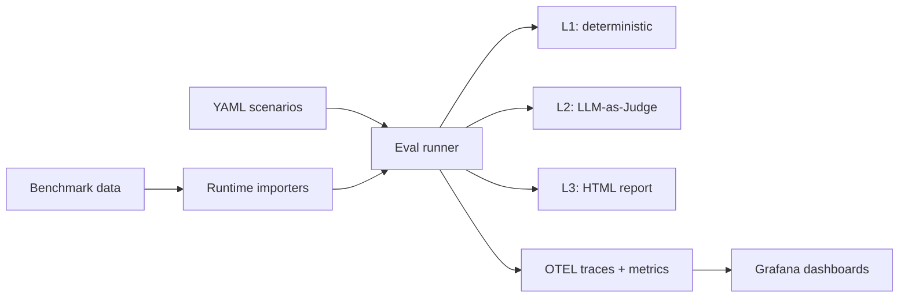

# AgentLens

[English](README.md) | [简体中文](README.zh-CN.md)

[](https://github.com/wjmoss/agentlens/actions/workflows/ci.yml)
[](https://www.python.org/downloads/)
[](LICENSE)

Evaluate AI agents the way you'd test any other system: deterministic checks first, semantic scoring when it matters, full traces when you need to debug.

AgentLens is an evaluation and observability toolkit for LLM-based agents. It runs locally, integrates with CI, and produces results you can actually act on.

```
Scenario tc-001: Read File Content
  L1  tools: PASS  output: PASS  trajectory: PASS  safety: PASS
  L2  accuracy: 5/5 — "Output matches reference content exactly."
  ──────────────────────────────────────────────────────────────
  PASS
```

## Quick Start

```bash
# Setup
python3.11 -m venv .venv
source .venv/bin/activate
pip install -e ".[dev]"

# Run all scenarios (dry run — no LLM calls)
python -m agentlens.eval --dry-run

# Run a single scenario
python -m agentlens.eval --scenario-id tc-001

# Run with LLM-as-Judge scoring
python -m agentlens.eval --scenario-id tc-001 --level2

# Generate an HTML report
python -m agentlens.eval --level2 --output report.html
```

## How Evaluation Works

Each scenario goes through up to three layers:

| Layer | What it checks | Cost | Stability |
|-------|---------------|------|-----------|
| **L1** Deterministic | Tool usage, output content, trajectory, parameters, termination, safety | Zero | High |
| **L2** LLM-as-Judge | Semantic quality via rubrics and optional metrics | 1+ LLM call | Medium |
| **L3** HTML Report | Human-readable summary with explanations and drill-down | Zero | — |

L1 catches the failures you can define upfront. L2 catches the ones you can't. L3 makes both inspectable.

### L1: Deterministic Checks

Six independent checks run on every scenario:

- **Tool usage** — Did the agent call the expected tools?
- **Output format** — Does the output contain required substrings?
- **Trajectory** — Step count, loop detection, strategy drift, subtask switching
- **Tool parameters** — Were tool calls made with valid arguments?
- **Termination** — Did the agent stop correctly?
- **Safety** — Were safety constraints respected?

Each check produces a pass/fail result with structured failure reasons. No LLM calls needed.

### L2: LLM-as-Judge Scoring

When `--level2` is enabled, a judge model scores the agent's output against a rubric and optional reference answer. The base judge produces a 1–5 score with an explanation.

Five optional metrics extend the base judge:

| Metric | What it measures | Method |
|--------|-----------------|--------|
| `--geval` | Rubric alignment | Two-phase CoT: generate evaluation steps, then score against them ([G-Eval](https://arxiv.org/abs/2303.16634)) |
| `--task-completion` | Sub-task coverage | Decompose query into tasks, verify each against the trajectory |
| `--answer-relevancy` | Statement-level relevance | Decompose answer into atomic statements, judge each for query relevance ([FActScore](https://aclanthology.org/2023.emnlp-main.741/)) |
| `--hallucination` | Contradiction with context | NLI-based check against provided or trace-extracted context ([CoNLI](https://arxiv.org/abs/2310.03951)) |
| `--faithfulness` | Grounding in context | Verify each claim is supported by available evidence ([SAFE](https://arxiv.org/abs/2403.18802)) |

Every metric is independently switchable. Enable any combination:

```bash
# Baseline rubric only
python -m agentlens.eval --level2

# G-Eval replaces the base judge with structured two-phase scoring
python -m agentlens.eval --level2 --geval

# Add specific metrics
python -m agentlens.eval --level2 --geval --hallucination --faithfulness

# Everything
python -m agentlens.eval --level2 --all-metrics
```

All metrics produce `JudgeScore` objects (dimension, score 1–5, explanation), so they flow through the same reporting, OTEL export, and comparison paths.

### L3: HTML Report

Pass `--output report.html` to generate a self-contained report:

- Summary cards: total, passed, partial, risky, failed, pass rate
- Per-scenario detail: L1 results, L2 scores and explanations, failure reasons
- Benchmark-level aggregation when running benchmark suites

## Writing Scenarios

Scenarios are YAML files in `src/agentlens/scenarios/`:

```yaml
id: tc-001
name: "Read File Content"
category: tool_calling
input:
  query: "Read the file /tmp/agentlens_test/data.txt and tell me its contents"
  setup:
    - "mkdir -p /tmp/agentlens_test && echo 'hello agentlens' > /tmp/agentlens_test/data.txt"
expected:
  tools_called: ["read_file"]
  max_steps: 3
  output_contains: ["hello agentlens"]
judge_rubric: "accuracy"
reference_answer: "The file contains: hello agentlens"
```

| Field | Purpose |
|-------|---------|
| `input.query` | The prompt sent to the agent |
| `input.setup` | Shell commands run before the agent starts |
| `expected.tools_called` | L1: which tools must appear in the trace |
| `expected.output_contains` | L1: substrings the output must include |
| `expected.max_steps` | L1: upper bound on trajectory length |
| `judge_rubric` | L2: scoring dimension (`accuracy`, `task_completion`, `answer_relevancy`, etc.) |
| `reference_answer` | L2: ground truth for the judge |
| `context` | L2 (optional): explicit context for hallucination/faithfulness checks |

Scenarios without `judge_rubric` run L1 only. Add `context: [...]` to provide grounding documents for hallucination or faithfulness metrics.

## Feature Flags

Every L2 metric can be toggled from the CLI or from `.env` config:

| CLI flag | Environment variable | Default |
|----------|---------------------|---------|
| `--geval` | `JUDGE_USE_GEVAL` | off |
| `--task-completion` | `JUDGE_TASK_COMPLETION` | off |
| `--answer-relevancy` | `JUDGE_ANSWER_RELEVANCY` | off |
| `--hallucination` | `JUDGE_HALLUCINATION` | off |
| `--faithfulness` | `JUDGE_FAITHFULNESS` | off |
| `--all-metrics` | — | off |

CLI and config flags use OR logic. If neither is set, the base judge runs alone.

This makes ablation experiments straightforward: run the same scenarios with different metric combinations and compare the HTML reports.

## Model Providers

AgentLens supports multiple LLM providers for both the agent and the judge:

```bash
# Provider syntax: provider:model-name
AGENT_MODEL=gemini:gemini-2.5-flash
JUDGE_MODEL=gemini:gemini-2.5-flash-lite
```

| Provider | Prefix | Example |
|----------|--------|---------|
| Gemini | `gemini:` | `gemini:gemini-2.5-flash` |
| DeepSeek | `deepseek:` | `deepseek:deepseek-chat` |
| OpenRouter | `openrouter:` | `openrouter:openai/gpt-4o-mini` |
| Zhipu (GLM) | `zhipu:` | `zhipu:glm-4-plus` |

Mix providers freely — run a DeepSeek agent with a Gemini judge, or vice versa:

```bash
AGENT_MODEL=deepseek:deepseek-chat
JUDGE_MODEL=gemini:gemini-2.5-flash-lite
```

Override per run via CLI:

```bash
python -m agentlens.eval --scenario-id tc-001 \
  --agent-model openrouter:openai/gpt-4o-mini \
  --judge-model gemini:gemini-2.5-flash-lite
```

Each provider validates credentials and quota before running scenarios. Failures surface early with clear messages.

## Benchmarks

AgentLens loads benchmark data at runtime from `data/benchmarks/<slug>/`.

### Supported Benchmarks

| Benchmark | Slug | Scoring |
|-----------|------|---------|
| GDPval-AA | `gdpval-aa` | Built-in (`--level2`) |
| SWE-Bench Pro | `swe-bench-pro` | External harness |
| Multi-SWE Bench | `multi-swe-bench` | External harness |
| Toolathlon | `toolathlon` | External harness |
| VIBE-Pro | `vibe-pro` | External harness |
| MLE-Bench Lite | `mle-bench-lite` | External harness |
| MM-ClawBench | `mm-clawbench` | External harness |
| Artificial Analysis | `artificial-analysis` | External harness |

### Dataset Pipeline

Build versioned, reproducible datasets from scenarios and benchmarks:

```bash
# Build a dataset version
python -m agentlens.dataset \
  --benchmark gdpval-aa \
  --name gdpval-regression \
  --output data/datasets/gdpval-regression-v1.json

# Run eval from a dataset version
python -m agentlens.eval \
  --dataset-version-file data/datasets/gdpval-regression-v1.json \
  --level2 --output gdpval.html
```

### Benchmark Sandbox

Benchmark scenarios run in a sandbox by default. Non-task commands (`pip`, `curl`, `open`) are blocked unless a benchmark profile explicitly allows them.

Override per benchmark with `data/benchmarks/<slug>/sandbox_profile.json`:

```json
{
  "allowed_commands": ["python", "python3", "pip", "ls", "cp", "mv"],
  "blocked_commands": ["curl", "wget", "open"],
  "required_python_modules": ["openpyxl", "pandas"]
}
```

### Downloading Benchmark Data

```bash
# GDPval-AA
pip install -e ".[benchmarks]"
hf download openai/gdpval \
  --repo-type dataset --include "data/*.parquet" \
  --local-dir data/benchmarks/gdpval-aa

# Multi-SWE Bench
hf download bytedance-research/Multi-SWE-Bench \
  --repo-type dataset --include "*.jsonl" \
  --local-dir data/benchmarks/multi-swe-bench
```

## Observability

AgentLens instruments every run with OpenTelemetry. When a collector is available, you get:

- Agent run, tool call, and LLM latency metrics
- Judge scores by dimension in Prometheus
- Full traces in Tempo with eval status on the root span
- Feature flag attributes (`eval.flags.*`) on each trace

### Local Monitoring Stack

```bash
docker compose up -d
```

| Service | URL |
|---------|-----|
| Grafana | [localhost:3001](http://localhost:3001) (admin / admin) |
| Prometheus | [localhost:9090](http://localhost:9090) |
| Tempo | [localhost:3200](http://localhost:3200) |
| OTEL Collector | gRPC :4317, HTTP :4318 |

Dashboard panels include eval outcome mix, risk signals, failure patterns, judge scores by dimension, LLM latency by provider, and trace duration distribution.

If no collector is running, the eval runner still works — OTEL degrades gracefully.

## Configuration Reference

Minimal `.env`:

```bash
GOOGLE_API_KEY=your-key
AGENT_MODEL=gemini:gemini-2.5-flash
JUDGE_MODEL=gemini:gemini-2.5-flash-lite
```

Full `.env.example` is included in the repo. Notable options:

| Variable | Purpose | Default |
|----------|---------|---------|
| `AGENT_MODEL` | Model for the agent | — |
| `JUDGE_MODEL` | Model for L2 scoring | — |
| `AGENT_MAX_TOKENS` | Agent output token limit | `2048` |
| `JUDGE_MAX_TOKENS` | Judge output token limit | `512` |
| `AGENT_MAX_STEPS` | Max agent trajectory steps | `10` |
| `OTEL_EXPORTER_OTLP_ENDPOINT` | Collector endpoint | `http://localhost:4317` |
| `OTEL_SERVICE_NAME` | Service name in traces | `agentlens` |

API keys are only required for the providers you select.

## Architecture



```text
src/agentlens/
├── agents/              # Agent creation, tool presets
├── eval/
│   ├── level1_deterministic/   # 6 check modules
│   ├── level2_llm_judge/       # Judge + 5 optional metrics
│   ├── level3_human/           # HTML reporter
│   ├── runner.py               # Orchestration
│   └── scenarios.py            # YAML loader + data model
├── core/                # Local records, alerts, API
├── dataset/             # Versioned dataset pipeline
├── observability/       # OTEL spans + metrics
├── scenarios/           # Built-in YAML scenarios
└── config.py            # pydantic-settings
```

## CLI Reference

```bash
# Scenario operations
python -m agentlens.eval --dry-run                    # Validate without LLM calls
python -m agentlens.eval --list-benchmarks            # Show available benchmarks
python -m agentlens.eval --scenario-id tc-001         # Run one scenario
python -m agentlens.eval --scenarios path/to/dir      # Run from custom directory

# Evaluation levels
python -m agentlens.eval                              # L1 only
python -m agentlens.eval --level2                     # L1 + L2
python -m agentlens.eval --level2 --output report.html  # L1 + L2 + L3

# L2 metric selection
python -m agentlens.eval --level2 --geval
python -m agentlens.eval --level2 --task-completion --answer-relevancy
python -m agentlens.eval --level2 --all-metrics

# Benchmark execution
python -m agentlens.eval --benchmark gdpval-aa --level2
python -m agentlens.eval --benchmark gdpval-aa --dry-run

# Dataset pipeline
python -m agentlens.dataset --benchmark gdpval-aa --name v1 --output dataset.json
python -m agentlens.eval --dataset-version-file dataset.json --level2

# Importers and tooling
python -m agentlens.eval.importers --list-benchmarks
python -m agentlens.core --help
```

## Development

```bash
# Run tests (380 tests)
python -m pytest

# Lint
python -m ruff check src tests
```

## Research References

| Metric | Primary paper |
|--------|--------------|
| G-Eval | [G-Eval: NLG Evaluation using GPT-4 with Better Human Alignment](https://arxiv.org/abs/2303.16634) |
| Answer Relevancy | [FActScore: Fine-grained Atomic Evaluation of Factual Precision](https://aclanthology.org/2023.emnlp-main.741/) |
| Hallucination | [CoNLI: Chain of Natural Language Inference for Reducing Hallucinations](https://arxiv.org/abs/2310.03951) |
| Faithfulness | [SAFE: Long-form Factuality in Large Language Models](https://arxiv.org/abs/2403.18802) |

Additional references: [SelfCheckGPT](https://arxiv.org/abs/2303.08896), [TRUE](https://aclanthology.org/2022.naacl-main.287/), [VeriScore](https://aclanthology.org/2024.findings-emnlp.552/), [RAGAS](https://arxiv.org/abs/2309.15217)

## License

See [LICENSE](LICENSE).
