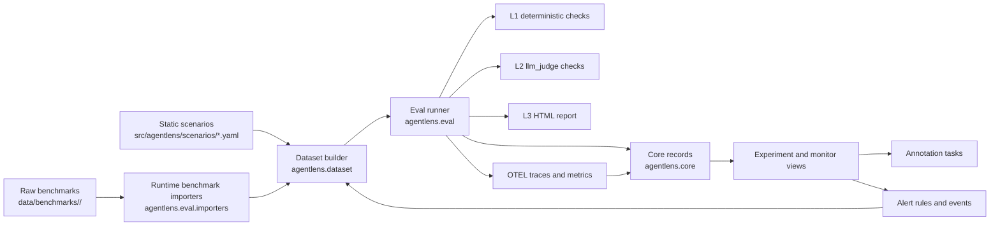

# AgentLens

[English](README.md) | [简体中文](README.zh-CN.md)

AgentLens is a lightweight evaluation and observability toolkit for AI agents.
It currently covers four main areas:

- Agent execution with LangGraph + LangChain
- Selectable model providers for both agent and judge
- Multi-level evaluation with deterministic checks, LLM-as-Judge, and HTML reports
- OpenTelemetry traces and metrics

## OSS Scope

Included in OSS:

- Local/CI SDK + CLI
- Runtime benchmark adapters and dataset build pipeline
- Eval runner (`deterministic` + `llm_judge`) and HTML reports
- OpenTelemetry instrumentation and basic local monitoring primitives
- Local core records (`src/agentlens/core/`): file/sqlite persistence, API/CLI inspection, alert-rule evaluation

Out of OSS (enterprise/private):

- Multi-tenant control plane and workspace isolation
- Enterprise identity stack (SSO, SCIM, fine-grained RBAC/ABAC)
- Compliance orchestration (SOC2, HIPAA, GDPR, retention/legal hold, compliance reporting)
- Managed on-prem packaging internals, data-residency policy operations, commercial SLA/billing/support tooling

## Architecture



Core reliability principles (OSS core):

- Stateless API/service handlers with persistent state in file/sqlite repositories
- Idempotent snapshot writes (`idempotency_key`) for retry-safe ingestion
- Bounded pagination (`limit`/`offset`) to control memory and backpressure
- Durable and concurrent SQLite behavior (`WAL`, `busy_timeout`, retry with backoff)
- Deterministic audit and alert event IDs to prevent duplicates during retries

Core packages and responsibilities:

- `src/agentlens/agents/`: runtime agent creation and tool presets
- `src/agentlens/model_selection.py` + `src/agentlens/llms.py`: provider/model resolution and model client construction
- `src/agentlens/eval/`: runtime scenario loading, benchmark adapters, eval runner, L1/L2/L3 evaluation outputs
- `src/agentlens/dataset/`: immutable dataset-version build and dataset-item to runtime-scenario conversion
- `src/agentlens/core/`: local closed-loop records, file/sqlite repositories, local API/CLI, alert evaluation/events
- `src/agentlens/observability/`: OTEL instrumentation, spans, and metrics
- `src/agentlens/scenarios/`: handwritten static YAML scenarios

## Repository Layout

```text
agentlens/
├── src/agentlens/
│   ├── agents/
│   ├── scenarios/               # handwritten YAML scenarios
│   ├── eval/
│   │   ├── level1_deterministic/
│   │   ├── level2_llm_judge/
│   │   ├── level3_human/
│   │   ├── benchmarks.py
│   │   ├── importers.py
│   │   ├── runner.py
│   │   └── scenarios.py
│   ├── dataset/                 # dataset-version pipeline
│   ├── core/                    # local closed-loop records and APIs
│   └── observability/           # traces and metrics
├── data/
│   └── benchmarks/<slug>/       # raw benchmark files (runtime loaded)
├── infra/
├── tests/
└── pyproject.toml
```

## Environment Setup

Requirements:

- Python `3.11+`
- A local virtual environment in `.venv` is recommended

### 1. Create a virtual environment

```bash
python3.11 -m venv .venv
```

### 2. Activate it

For `zsh` / `bash`:

```bash
source .venv/bin/activate
```

To leave the virtual environment:

```bash
deactivate
```

### 3. Install dependencies

For normal development:

```bash
pip install -e ".[dev]"
```

If you want parquet support or benchmark downloads:

```bash
pip install -e ".[dev,benchmarks]"
```

`.[benchmarks]` also includes `openpyxl`, `pandas`, and `numpy`, which GDPval spreadsheet tasks rely on.

## Configuration

Settings are loaded via `pydantic-settings` from `.env`.
A minimal example:

```bash
GOOGLE_API_KEY=your_google_ai_studio_key
DEEPSEEK_API_KEY=your_deepseek_api_key
OPENROUTER_API_KEY=your_openrouter_api_key
ZHIPU_API_KEY=your_zhipu_api_key
DEEPSEEK_API_BASE=https://api.deepseek.com
OPENROUTER_API_BASE=https://openrouter.ai/api/v1
ZHIPU_API_BASE=https://open.bigmodel.cn/api/paas/v4
OPENROUTER_HTTP_REFERER=https://your-app.example
OPENROUTER_X_TITLE=AgentLens
AGENT_MODEL=gemini:gemini-2.5-flash
JUDGE_MODEL=gemini:gemini-2.5-flash-lite
AGENT_MAX_TOKENS=2048
JUDGE_MAX_TOKENS=512
OTEL_EXPORTER_OTLP_ENDPOINT=http://localhost:4317
OTEL_SERVICE_NAME=agentlens
AGENT_MAX_STEPS=10
```

Notes:

- `GOOGLE_API_KEY` is only required when you select a Gemini model.
- `DEEPSEEK_API_KEY` is only required when you select a DeepSeek model.
- `OPENROUTER_API_KEY` is only required when you select an OpenRouter model.
- `ZHIPU_API_KEY` is only required when you select a Zhipu model.
- `JUDGE_MODEL` is only used when `--level2` is enabled.
- `AGENT_MAX_TOKENS` limits agent output tokens (important for low-credit OpenRouter keys).
- `JUDGE_MAX_TOKENS` limits L2 judge output tokens (useful for low-credit OpenRouter keys).
- `OPENROUTER_HTTP_REFERER` and `OPENROUTER_X_TITLE` are optional, but recommended for OpenRouter requests.
- OTEL is optional. If no collector is available, the runner will degrade as gracefully as possible.

## Model Selection

`AGENT_MODEL` and `JUDGE_MODEL` both support:

- Explicit provider syntax: `gemini:gemini-2.5-flash`
- Bare model names (for example `deepseek-chat` or `glm-4-plus`)
- Namespaced model names (for example `openai/gpt-4o-mini`) are inferred as OpenRouter

Explicit provider syntax is recommended because it is clearer and avoids ambiguity.

Common examples:

```bash
AGENT_MODEL=gemini:gemini-2.5-flash
JUDGE_MODEL=gemini:gemini-2.5-flash-lite
```

```bash
AGENT_MODEL=deepseek:deepseek-chat
JUDGE_MODEL=deepseek:deepseek-chat
```

```bash
AGENT_MODEL=openrouter:openai/gpt-4o-mini
JUDGE_MODEL=openrouter:openai/gpt-4o-mini
```

```bash
AGENT_MODEL=zhipu:glm-4-plus
JUDGE_MODEL=zhipu:glm-4-plus
```

Mixed setup:

```bash
AGENT_MODEL=deepseek:deepseek-chat
JUDGE_MODEL=openrouter:openai/gpt-4o-mini
```

Temporary CLI override:

```bash
./.venv/bin/python -m agentlens.eval \
  --agent-model openrouter:openai/gpt-4o-mini \
  --judge-model openrouter:openai/gpt-4o-mini \
  --scenario-id tc-001
```

Notes:

- `deepseek:deepseek-chat` is a good default for general tool-using agent runs.
- The judge can use Gemini, DeepSeek, OpenRouter, or Zhipu.
- When a DeepSeek model is selected, AgentLens performs a balance preflight check before running scenarios. If the account has insufficient balance, the command fails early with a clear error.
- When an OpenRouter model is selected, AgentLens performs a key preflight check before running scenarios and fails early on auth/credit issues.
- When a Zhipu model is selected, AgentLens validates key/base-url configuration before running scenarios.

## Local Development Commands

Run tests:

```bash
./.venv/bin/python -m pytest
```

Run lint:

```bash
./.venv/bin/python -m ruff check src tests
```

Show CLI help:

```bash
./.venv/bin/python -m agentlens.eval --help
./.venv/bin/python -m agentlens.eval.importers --help
./.venv/bin/python -m agentlens.dataset --help
./.venv/bin/python -m agentlens.core --help
./.venv/bin/python -m agentlens.core.api --help
```

## Running Built-In YAML Scenarios

List loaded benchmarks and scenario counts:

```bash
./.venv/bin/python -m agentlens.eval --list-benchmarks
```

Dry run without calling the model:

```bash
./.venv/bin/python -m agentlens.eval --dry-run
```

Run a single scenario:

```bash
./.venv/bin/python -m agentlens.eval --scenario-id tc-001
```

Run a single scenario with DeepSeek:

```bash
./.venv/bin/python -m agentlens.eval \
  --scenario-id tc-001 \
  --agent-model deepseek:deepseek-chat
```

Generate an HTML report:

```bash
./.venv/bin/python -m agentlens.eval --output report.html
```

## Running Benchmarks

### Key Principle

- Put raw benchmark files under `data/benchmarks/<slug>/`
- AgentLens discovers and loads them dynamically at runtime
- Generated benchmark YAML files are no longer part of the workflow
- Eval now supports a dataset-version execution path for reproducible runs

### Two-Pipeline Workflow

Build a dataset version from local scenarios and benchmark data:

```bash
./.venv/bin/python -m agentlens.dataset \
  --benchmark gdpval-aa \
  --name gdpval-regression \
  --output data/datasets/gdpval-regression-v1.json
```

Run eval directly from a dataset version file:

```bash
./.venv/bin/python -m agentlens.eval \
  --dataset-version-file data/datasets/gdpval-regression-v1.json \
  --level2 \
  --output gdpval.html
```

Run eval from a stored dataset version id:

```bash
./.venv/bin/python -m agentlens.eval \
  --dataset-version-id <dataset_version_id> \
  --platform-store .agentlens-platform \
  --platform-project-slug qa-project
```

Compatibility mode remains available: `--benchmark` on `agentlens.eval` still works, and the runner builds an in-memory dataset version before execution.
When `--platform-store` or `--platform-sqlite` is set, this compatibility path uses a deterministic dataset fingerprint and reuses the same dataset version id instead of generating duplicates.
(`--platform-*` flags are currently kept for backward compatibility even though the OSS module namespace is now `agentlens.core`.)

### Supported Benchmarks

| Benchmark | slug | Expected input | Default evaluation mode | Can the built-in runner score it directly? |
| --- | --- | --- | --- | --- |
| SWE Bench Pro | `swe-bench-pro` | `data/*.parquet` | `external` | No, requires an external harness |
| Multi-SWE Bench | `multi-swe-bench` | `**/*.jsonl` | `external` | No, requires an external harness |
| GDPval-AA | `gdpval-aa` | `data/*.parquet` or record files | `llm_judge` | Yes, with `--level2` |
| Toolathlon | `toolathlon` | task directories | `external` | No, requires an external harness |
| VIBE-Pro | `vibe-pro` | manifest | `external` | Usually needs an external harness |
| MLE-Bench lite | `mle-bench-lite` | manifest | `external` | Usually needs an external harness |
| MM-ClawBench | `mm-clawbench` | manifest | `external` | Usually needs an external harness |
| Artificial Analysis | `artificial-analysis` | manifest | `external` | Depends on the manifest |

Evaluation mode summary:

- `deterministic`
  Uses tool usage, output content, and trajectory checks.
- `llm_judge`
  Requires `--level2` and uses a rubric plus a reference answer.
- `external`
  AgentLens can load, filter, inventory, and report these tasks, but does not score them as passing with the built-in runner.

### Benchmark Sandbox (Default)

Benchmark scenarios run inside a default sandbox policy (first-class, not opt-in):

- `prepare` phase (harness-controlled): validates required Python modules and benchmark reference files.
- `run` phase (agent-controlled): shell commands are checked against benchmark capability profiles.

During agent execution, non-task commands such as `pip`, `curl`, and GUI `open` are blocked unless a benchmark profile explicitly allows them.

You can override capabilities per benchmark with:

`data/benchmarks/<benchmark-slug>/sandbox_profile.json`

Example:

```json
{
  "allowed_commands": ["python", "python3", "pip", "ls", "cp", "mv"],
  "blocked_commands": ["curl", "wget", "open"],
  "required_python_modules": ["openpyxl", "pandas"],
  "extra_allowed_roots": ["workdir"]
}
```

### Benchmark Data Layout

Example layout:

```text
data/benchmarks/
├── gdpval-aa/
│   └── data/
│       └── train-00000-of-00001.parquet
├── multi-swe-bench/
│   ├── python/
│   │   └── multi_swe_bench_python.jsonl
│   └── rust/
│       └── tokio-rs__tokio_dataset.jsonl
└── swe-bench-pro/
    └── data/
        └── test-00000-of-00001.parquet
```

### Preview How Benchmark Data Maps to Runtime Scenarios

List available adapters:

```bash
./.venv/bin/python -m agentlens.eval.importers --list-benchmarks
```

Preview a record-style benchmark file:

```bash
./.venv/bin/python -m agentlens.eval.importers \
  --benchmark gdpval-aa \
  --input data/benchmarks/gdpval-aa/data/train-00000-of-00001.parquet \
  --limit 3
```

Preview a directory-style benchmark:

```bash
./.venv/bin/python -m agentlens.eval.importers \
  --benchmark multi-swe-bench \
  --input data/benchmarks/multi-swe-bench \
  --limit 3
```

### Run a Benchmark

1. Confirm that AgentLens can discover the benchmark:

```bash
./.venv/bin/python -m agentlens.eval --list-benchmarks
```

2. Dry run the benchmark selection:

```bash
./.venv/bin/python -m agentlens.eval --benchmark gdpval-aa --dry-run
```

3. Run a benchmark that the built-in runner can score:

```bash
./.venv/bin/python -m agentlens.eval --benchmark gdpval-aa --level2 --output gdpval.html
```

4. For `external` benchmarks, use dry-run and inventory mode first:

```bash
./.venv/bin/python -m agentlens.eval --benchmark swe-bench-pro --dry-run
./.venv/bin/python -m agentlens.eval --benchmark multi-swe-bench --dry-run
```

If your benchmark root is elsewhere:

```bash
./.venv/bin/python -m agentlens.eval \
  --benchmark gdpval-aa \
  --benchmark-data-root /absolute/path/to/benchmarks \
  --dry-run
```

## Downloading Benchmark Data with the Hugging Face CLI

If the benchmark extra dependencies are installed and `hf` is available, you can download files directly into the layout expected by AgentLens.

GDPval-AA example:

```bash
./.venv/bin/hf download openai/gdpval \
  --repo-type dataset \
  --include "data/*.parquet" \
  --local-dir data/benchmarks/gdpval-aa
```

Multi-SWE Bench example:

```bash
./.venv/bin/hf download bytedance-research/Multi-SWE-Bench \
  --repo-type dataset \
  --include "*.jsonl" \
  --local-dir data/benchmarks/multi-swe-bench
```

For other benchmarks, any download method is fine as long as the final layout matches the adapter expectations.

## Reports and Observability

The CLI output includes:

- PASS / FAIL for each scenario
- Benchmark-level summary
- Error messages

If you pass `--output report.html`, the generated report includes:

- Overall pass rate
- Benchmark summary
- L1 / L2 details for each scenario

If an OTEL collector is available, AgentLens also exports:

- Agent run metrics
- Tool call metrics
- LLM token and latency metrics

## FAQ

### 1. Why does a benchmark say it requires an external harness?

That is expected for benchmarks such as `swe-bench-pro` and `multi-swe-bench`.
Their real scoring depends on their own evaluation harnesses.
AgentLens currently handles:

- Runtime task loading
- Filtering and inventory
- Unified reporting
- Avoiding false PASS results for externally scored tasks

### 2. Why does GDPval-AA require `--level2`?

Its main scoring signal comes from rubric text and a reference answer, so it runs in `llm_judge` mode.

### 3. Why do I see `sysctlbyname failed` warnings from `pyarrow` on macOS?

Those warnings are common in restricted environments and usually do not affect parquet loading.
