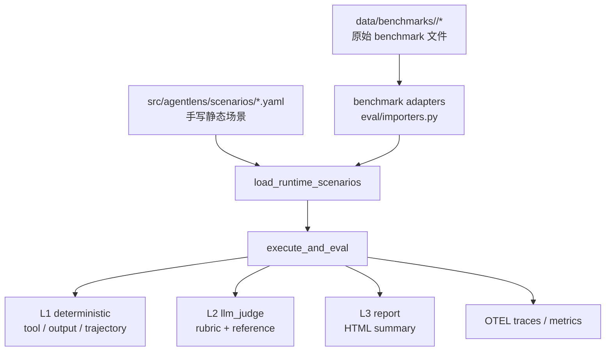

# AgentLens

[English](README.md) | [简体中文](README.zh-CN.md)

AgentLens 是一个用于评估 AI Agent 行为的轻量平台，包含四部分能力：

- 运行 agent：基于 LangGraph + LangChain 执行任务
- 模型选择：支持 Gemini 和 DeepSeek，并且可以分别选择 agent / judge 模型
- 评估结果：支持确定性规则检查、LLM-as-Judge 和 HTML 报告
- 观测数据：通过 OpenTelemetry 导出 trace 和 metrics

当前仓库已经切到“benchmark 原始数据动态加载”架构：

- 常规手写场景保存在 `src/agentlens/scenarios/` 下的 YAML
- benchmark 原始文件保存在 `data/benchmarks/<slug>/` 下
- 运行时不会再把 benchmark 批量展开并持久化成生成的 YAML

## 系统架构



核心模块：

- `src/agentlens/agents/factory.py`
  负责创建运行时 agent 和工具预设。
- `src/agentlens/model_selection.py`
  解析 `provider:model` 形式的模型选择，例如 `gemini:gemini-2.5-flash` 和 `deepseek:deepseek-chat`。
- `src/agentlens/llms.py`
  负责构建 Gemini 和 DeepSeek 的 provider-specific chat model。
- `src/agentlens/deepseek.py`
  负责 DeepSeek 的预检逻辑，包括余额检查。
- `src/agentlens/eval/scenarios.py`
  定义 `Scenario` 模型，并把静态 YAML 场景和动态 benchmark 任务合并成运行时场景列表。
- `src/agentlens/eval/importers.py`
  把 parquet / jsonl / manifest / 任务目录实时映射成运行时场景。
- `src/agentlens/eval/runner.py`
  执行 agent、采集 spans、完成评估，并处理 retry / quota / external benchmark。
- `src/agentlens/eval/level3_human/reporter.py`
  生成 HTML 报告。
- `src/agentlens/observability/`
  负责 telemetry 初始化和指标记录。

## 目录结构

```text
agentlens/
├── src/agentlens/
│   ├── agents/
│   ├── eval/
│   │   ├── level1_deterministic/
│   │   ├── level2_llm_judge/
│   │   ├── level3_human/
│   │   ├── benchmarks.py
│   │   ├── importers.py
│   │   ├── runner.py
│   │   └── scenarios.py
│   ├── observability/
│   └── scenarios/
│       ├── reasoning/
│       ├── recovery/
│       └── tool_calling/
├── data/benchmarks/
│   └── <slug>/
├── tests/
└── pyproject.toml
```

## 环境准备

要求：

- Python `3.11+`
- 建议在项目根目录使用本地虚拟环境 `.venv`

### 1. 创建 venv

```bash
python3.11 -m venv .venv
```

### 2. 激活 venv

`zsh` / `bash`:

```bash
source .venv/bin/activate
```

退出虚拟环境：

```bash
deactivate
```

### 3. 安装依赖

日常开发：

```bash
pip install -e ".[dev]"
```

如果要加载 parquet 或下载 benchmark 数据：

```bash
pip install -e ".[dev,benchmarks]"
```

## 环境变量

项目通过 `pydantic-settings` 从 `.env` 读取配置。最小示例：

```bash
GOOGLE_API_KEY=your_google_ai_studio_key
DEEPSEEK_API_KEY=your_deepseek_api_key
DEEPSEEK_API_BASE=https://api.deepseek.com
AGENT_MODEL=gemini:gemini-2.5-flash
JUDGE_MODEL=gemini:gemini-2.5-flash-lite
OTEL_EXPORTER_OTLP_ENDPOINT=http://localhost:4317
OTEL_SERVICE_NAME=agentlens
AGENT_MAX_STEPS=10
```

说明：

- `GOOGLE_API_KEY` 只在选择 Gemini 模型时需要
- `DEEPSEEK_API_KEY` 只在选择 DeepSeek 模型时需要
- `JUDGE_MODEL` 只在 `--level2` 时使用
- 没有 OTEL collector 也可以运行；系统会尽量优雅降级

## Model Select

`AGENT_MODEL` 和 `JUDGE_MODEL` 都支持两种写法：

- 显式 provider：`gemini:gemini-2.5-flash`
- 直接写模型名：`deepseek-chat`

推荐始终显式写 provider，这样更清楚，也更方便在多 provider 间切换。

常见例子：

```bash
AGENT_MODEL=gemini:gemini-2.5-flash
JUDGE_MODEL=gemini:gemini-2.5-flash-lite
```

```bash
AGENT_MODEL=deepseek:deepseek-chat
JUDGE_MODEL=deepseek:deepseek-chat
```

也可以混搭：

```bash
AGENT_MODEL=deepseek:deepseek-chat
JUDGE_MODEL=gemini:gemini-2.5-flash-lite
```

如果只是临时切换，不改 `.env`，也可以直接走 CLI override：

```bash
./.venv/bin/python -m agentlens.eval \
  --agent-model deepseek:deepseek-chat \
  --judge-model deepseek:deepseek-chat \
  --scenario-id tc-001
```

说明：

- `deepseek:deepseek-chat` 适合作为通用工具调用 agent 的默认选择
- judge 侧可以继续用 Gemini，也可以切到 DeepSeek
- 如果选中了 DeepSeek，AgentLens 会在真正开跑前先做一次余额预检；余额不足时会直接提前报错

## 本地开发命令

运行测试：

```bash
./.venv/bin/python -m pytest
```

跑 lint：

```bash
./.venv/bin/python -m ruff check src tests
```

查看 CLI 参数：

```bash
./.venv/bin/python -m agentlens.eval --help
./.venv/bin/python -m agentlens.eval.importers --help
```

## 运行内置 YAML 场景

列出当前可加载的 benchmark 和场景数量：

```bash
./.venv/bin/python -m agentlens.eval --list-benchmarks
```

只做 dry-run，不真正调用模型：

```bash
./.venv/bin/python -m agentlens.eval --dry-run
```

只跑单个场景：

```bash
./.venv/bin/python -m agentlens.eval --scenario-id tc-001
```

临时切到 DeepSeek 跑单个场景：

```bash
./.venv/bin/python -m agentlens.eval \
  --scenario-id tc-001 \
  --agent-model deepseek:deepseek-chat
```

生成 HTML 报告：

```bash
./.venv/bin/python -m agentlens.eval --output report.html
```

## Benchmark 运行方式

### 关键原则

- benchmark 原始文件放到 `data/benchmarks/<slug>/`
- AgentLens 运行时动态发现并加载这些文件
- 不再生成或依赖 `src/agentlens/scenarios/benchmarks/*.yaml`

### 支持的 benchmark

| Benchmark | slug | 期望输入 | 默认评估模式 | 内置 runner 是否能直接评分 |
| --- | --- | --- | --- | --- |
| SWE Bench Pro | `swe-bench-pro` | `data/*.parquet` | `external` | 否，需要外部 harness |
| Multi-SWE Bench | `multi-swe-bench` | `**/*.jsonl` | `external` | 否，需要外部 harness |
| GDPval-AA | `gdpval-aa` | `data/*.parquet` 或 records 文件 | `llm_judge` | 可以，需加 `--level2` |
| Toolathlon | `toolathlon` | 任务目录 | `external` | 否，需要外部 harness |
| VIBE-Pro | `vibe-pro` | manifest | `external` | 通常需要外部 harness |
| MLE-Bench lite | `mle-bench-lite` | manifest | `external` | 通常需要外部 harness |
| MM-ClawBench | `mm-clawbench` | manifest | `external` | 通常需要外部 harness |
| Artificial Analysis | `artificial-analysis` | manifest | `external` | 取决于 manifest |

评估模式说明：

- `deterministic`
  只看工具调用、输出内容、轨迹等规则。
- `llm_judge`
  需要 `--level2`，使用 rubric 和参考答案做评分。
- `external`
  AgentLens 可以加载、筛选、列出和出报告，但不会把它误判成 PASS；真正评分要接外部 benchmark harness。

### Benchmark 数据放置约定

示例目录：

```text
data/benchmarks/
├── gdpval-aa/
│   └── data/
│       └── train-00000-of-00001.parquet
├── multi-swe-bench/
│   ├── python/
│   │   └── multi_swe_bench_python.jsonl
│   └── rust/
│       └── tokio-rs__tokio_dataset.jsonl
└── swe-bench-pro/
    └── data/
        └── test-00000-of-00001.parquet
```

### 预览 benchmark 会被映射成什么场景

先看 adapter 支持列表：

```bash
./.venv/bin/python -m agentlens.eval.importers --list-benchmarks
```

预览某个 records 风格 benchmark 文件：

```bash
./.venv/bin/python -m agentlens.eval.importers \
  --benchmark gdpval-aa \
  --input data/benchmarks/gdpval-aa/data/train-00000-of-00001.parquet \
  --limit 3
```

预览目录型 benchmark：

```bash
./.venv/bin/python -m agentlens.eval.importers \
  --benchmark multi-swe-bench \
  --input data/benchmarks/multi-swe-bench \
  --limit 3
```

### 运行 benchmark

1. 先确认 AgentLens 已经能发现 benchmark：

```bash
./.venv/bin/python -m agentlens.eval --list-benchmarks
```

2. 只看会加载哪些任务：

```bash
./.venv/bin/python -m agentlens.eval --benchmark gdpval-aa --dry-run
```

3. 真正运行可由内置 runner 评分的 benchmark：

```bash
./.venv/bin/python -m agentlens.eval --benchmark gdpval-aa --level2 --output gdpval.html
```

4. 对 `external` 类型 benchmark，先用 dry-run / inventory 模式：

```bash
./.venv/bin/python -m agentlens.eval --benchmark swe-bench-pro --dry-run
./.venv/bin/python -m agentlens.eval --benchmark multi-swe-bench --dry-run
```

如果 benchmark 数据放在别的位置，也可以显式传入：

```bash
./.venv/bin/python -m agentlens.eval \
  --benchmark gdpval-aa \
  --benchmark-data-root /absolute/path/to/benchmarks \
  --dry-run
```

## 用 Hugging Face CLI 下载 benchmark 数据

如果已经安装了 benchmark extra，并且系统里有 `hf` 命令，可以直接下载到 AgentLens 期望的目录布局。

GDPval-AA 示例：

```bash
./.venv/bin/hf download openai/gdpval \
  --repo-type dataset \
  --include "data/*.parquet" \
  --local-dir data/benchmarks/gdpval-aa
```

Multi-SWE Bench 示例：

```bash
./.venv/bin/hf download bytedance-research/Multi-SWE-Bench \
  --repo-type dataset \
  --include "*.jsonl" \
  --local-dir data/benchmarks/multi-swe-bench
```

对于其他 benchmark，只要最终文件布局满足 adapter 约定，用 Hugging Face CLI、`curl` 或你自己的同步脚本都可以。

## 报告与观测

命令行会输出：

- 每条场景的 PASS / FAIL
- benchmark 维度汇总
- 错误原因

如果传 `--output report.html`，会生成包含以下信息的 HTML：

- 总体 pass rate
- benchmark summary
- 每条场景的 L1 / L2 细节

如果 OTEL collector 可用，还会导出：

- agent run metrics
- tool call metrics
- LLM token / latency metrics

## 常见问题

### 1. 运行 benchmark 时提示需要 external harness

这是预期行为。像 `swe-bench-pro`、`multi-swe-bench` 这类 benchmark 的正确评分依赖它们自己的外部评测流程。AgentLens 当前负责：

- 动态加载任务
- 做 inventory / filtering
- 统一报告
- 避免把这些任务误判成 PASS

### 2. GDPval-AA 为什么一定要 `--level2`

因为它的主要评分信号来自 rubric 文本和参考答案，属于 `llm_judge` 模式。

### 3. macOS 下 `pyarrow` 打印 `sysctlbyname failed`

在受限环境里这是常见警告，通常不影响 parquet 读取。
