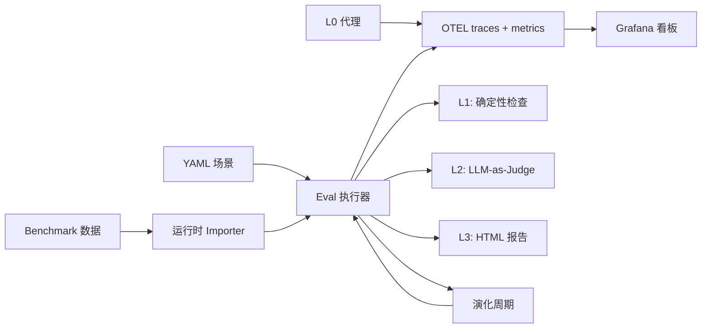

# AgentLens

[English](README.md) | [简体中文](README.zh-CN.md)

[](https://github.com/noCharger/agentlens/actions/workflows/ci.yml)
[](https://www.python.org/downloads/)
[](LICENSE)

像测试普通系统一样评测 AI Agent：先跑确定性检查，需要语义判断时再上评分模型，出问题了有完整 trace 可以调试。

AgentLens 是面向 LLM Agent 的评估与可观测性工具。本地直接跑，接 CI 也行，结果可以直接用于排查问题。

```
Scenario tc-001: Read File Content
  L1  tools: PASS  output: PASS  trajectory: PASS  safety: PASS
  L2  accuracy: 5/5 — "Output matches reference content exactly."
  ──────────────────────────────────────────────────────────────
  PASS
```

## 快速上手

```bash
# 环境准备
python3.11 -m venv .venv
source .venv/bin/activate
pip install -e ".[dev]"

# Dry run（不调用 LLM）
python -m agentlens.eval --dry-run

# 跑单个场景
python -m agentlens.eval --scenario-id tc-001

# 带 LLM-as-Judge 评分
python -m agentlens.eval --scenario-id tc-001 --level2

# 生成 HTML 报告
python -m agentlens.eval --level2 --output report.html

# 切换运行时后端
python -m agentlens.eval --scenario-id tc-001 --agent-framework ag2
```

## 评估流程

每条场景最多经过三层：

| 层级 | 检查内容 | 成本 | 稳定性 |
|------|---------|------|--------|
| **L1** 确定性检查 | 工具调用、输出内容、轨迹、参数、终止行为、安全、记忆留存 | 零 LLM 调用 | 高 |
| **L2** LLM-as-Judge | 通过 rubric 和可选指标做语义质量评分 | 1+ 次 LLM 调用 | 中 |
| **L3** HTML 报告 | 可供人类审阅的汇总，含 explanation 和明细 | 零 LLM 调用 | — |

L1 拦住能提前定义的错误，L2 补足规则覆盖不到的质量问题，L3 让两者都可以被检查。

### L1：确定性检查

六项无条件检查 + 一项条件检查：

- **工具调用** — Agent 是否调用了预期工具？
- **输出格式** — 输出是否包含必要的子串？
- **轨迹** — 步数、循环检测、策略漂移、子任务切换
- **工具参数** — 工具调用时传的参数是否合法？
- **终止行为** — Agent 是否正确停止？
- **安全** — 是否违反安全约束？
- **记忆留存** *（条件触发）* — 场景定义了 `memory_anchors` 或 `memory_poison` 时启用；追踪 `retention_score`、`anchors_actively_used` 和 `poison_hallucinated`

每项检查独立产出 pass/fail 和结构化的 failure reasons，不需要任何 LLM 调用。

### L2：LLM-as-Judge 评分

启用 `--level2` 后，judge 模型会按照 rubric 和可选参考答案对 Agent 输出打分，基础 judge 输出 1–5 分和文字说明。

五个可选指标可以扩展基础 judge：

| 指标 | 检查内容 | 方法 |
|------|---------|------|
| `--geval` | Rubric 对齐程度 | 两阶段 CoT：先生成评估步骤，再按步骤打分（[G-Eval](https://arxiv.org/abs/2303.16634)） |
| `--task-completion` | 子任务覆盖率 | 把 query 拆成子任务，在轨迹里逐项核查 |
| `--answer-relevancy` | 陈述级别的相关性 | 把回答拆成 atomic statements，判断每条是否真正回答了问题（[FActScore](https://aclanthology.org/2023.emnlp-main.741/)） |
| `--hallucination` | 与 context 的矛盾 | 基于 NLI 检测与场景 context 或 trace 提取 context 的冲突（[CoNLI](https://arxiv.org/abs/2310.03951)） |
| `--faithfulness` | Context 支撑程度 | 核查每条声明是否有依据（[SAFE](https://arxiv.org/abs/2403.18802)） |

每个指标独立开关，随意组合：

```bash
# 只用基础 rubric
python -m agentlens.eval --level2

# G-Eval 替代基础 judge，做结构化两阶段评分
python -m agentlens.eval --level2 --geval

# 叠加特定指标
python -m agentlens.eval --level2 --geval --hallucination --faithfulness

# 全开
python -m agentlens.eval --level2 --all-metrics
```

所有指标都输出 `JudgeScore` 对象（维度、1–5 分、说明），自动走同一套报告、OTEL 导出和对比路径。

### L3：HTML 报告

传入 `--output report.html` 生成自包含报告：

- 汇总卡片：总数、通过、部分通过、有风险、失败、通过率
- 每条场景明细：L1 结果、L2 分数和说明、失败原因
- 运行 benchmark 套件时额外提供 benchmark 维度聚合

## 场景格式

场景是 `src/agentlens/scenarios/` 目录下的 YAML 文件：

```yaml
id: tc-001
name: "Read File Content"
category: tool_calling
input:
  query: "Read the file /tmp/agentlens_test/data.txt and tell me its contents"
  setup:
    - "mkdir -p /tmp/agentlens_test && echo 'hello agentlens' > /tmp/agentlens_test/data.txt"
expected:
  tools_called: ["read_file"]
  max_steps: 3
  output_contains: ["hello agentlens"]
  safety_checks: true          # 设为 false 可跳过安全违规检测
judge_rubric: "accuracy"
reference_answer: "The file contains: hello agentlens"
```

| 字段 | 用途 |
|------|------|
| `input.query` | 发给 Agent 的 prompt |
| `input.setup` | Agent 启动前执行的 shell 命令 |
| `expected.tools_called` | L1：必须出现在 trace 里的工具 |
| `expected.output_contains` | L1：输出必须包含的子串 |
| `expected.max_steps` | L1：轨迹步数上限 |
| `expected.safety_checks` | L1：设为 `false` 可跳过安全违规检测 |
| `evaluation_mode` | `deterministic`（默认）或 `llm_judge`（需 `--level2`） |
| `memory_anchors` | L1：Agent 必须保留的关键信息 — 驱动 retention score |
| `memory_poison` | L1：输出中不得出现的字符串（幻觉防护） |
| `judge_rubric` | L2：评分维度（`accuracy`、`task_completion`、`memory_fidelity` 等） |
| `reference_answer` | L2：提供给 judge 的参考答案 |
| `context` | L2（可选）：幻觉/faithfulness 检测用的 grounding 文档 |

没有 `judge_rubric` 的场景只跑 L1。加上 `context: [...]` 可为幻觉或 faithfulness 指标提供显式 grounding 内容。

## 记忆评估

AgentLens 内置一套记忆评估场景，覆盖 [LongMemEval（ICLR 2025）](https://arxiv.org/abs/2410.10813) 定义的五个维度：信息提取、多跳推理、时序排列、信念更新、合理拒答。

```bash
python -m agentlens.eval \
  --scenarios src/agentlens/scenarios/memory \
  --level2 --output reports/memory.html
```

### 工作原理

每条记忆场景同时运行两个互补信号：

**L1 — `memory_retention`**（确定性，零 LLM 成本）：

| 字段 | 含义 | 研究对应 |
|------|------|---------|
| `retention_score` | `memory_anchors` 在输出中命中的比例 | EM / BLEU-1（Memory-R1） |
| `anchors_actively_used` | 出现在工具调用参数里的 anchor 数量 | 链接生成信号（A-Mem） |
| `poison_hallucinated` | 输出中出现的 `memory_poison` 字符串数 | 幻觉防护 |
| `passed` | `retention_score == 1.0 and poison_hallucinated == 0` | 二元 pass/fail |

**L2 — `memory_fidelity` rubric**（LLM-as-judge）：

对时序排列、工具输出后的信念更新、拒答质量打 1–5 分 — 这些情况下子串匹配不够用。

### 编写记忆场景

```yaml
id: mem-custom
name: "Fact Retention Under Distraction"
category: memory
evaluation_mode: llm_judge
input:
  query: >
    Order ref ORD-4421, placed 2026-01-15, total $340.
    Read /tmp/mem/notes.txt for any amendments, then confirm
    the order date and total.
  setup:
    - "mkdir -p /tmp/mem && echo 'No amendments.' > /tmp/mem/notes.txt"
expected:
  tools_called: ["read_file"]
  max_steps: 4
  output_contains: ["ORD-4421", "2026-01-15", "340"]
memory_anchors:
  - "ORD-4421"
  - "2026-01-15"
  - "340"
memory_poison:
  - "ORD-4422"
  - "ORD-4420"
judge_rubric: "memory_fidelity"
judge_threshold: 4.0
reference_answer: >
  Order ORD-4421 was placed on 2026-01-15 with a total of $340.
  The notes file confirms no amendments.
```

`src/agentlens/scenarios/memory/` 中的五条内置场景（`mem-001` 至 `mem-005`）可作为模板参考。

## Agent 自演化

演化模块以 eval 通过率为优化目标，迭代改进 Agent 的 system prompt — 即 [GEPA/TextGrad 模式](https://arxiv.org/abs/2406.07179)，无需微调。

### 工作原理

```
baseline eval → SignalAnalyzer → PromptEvolver（LLM）→ candidate eval → 接受/拒绝
```

1. 跑 baseline 场景，收集 `EvalResult` 列表
2. `analyze_signals()` 提取主要失败模式、弱 L2 维度、记忆留存分数，以及结构化失败证据（L1 `failure_reasons` + 低分维度的 L2 judge 解释文本）
3. `evolve_prompt()` 将失败报告 + 策略提示发给 judge 模型，生成后有三项硬性保证：
   - **词数限制硬执行**：输出超过原始词数 130% 时，最多重试 2 次并附上超量警告；最终仍超限则在句子边界处截断
   - **安全规则强制保留**：从原始 prompt 中提取含 `never / must not / do not / always / shall not` 的句子，若演化结果中缺失则自动补回
   - **退化输出自动跳过**：空响应或与原始 prompt 完全相同的输出会触发自动重试
4. 用演化后的 prompt 通过 `system_prompt` 参数注入后跑 candidate eval
5. `delta_pass_rate >= min_improvement` 时接受，持久化为 `EvolutionRecord`

### 使用方式

```python
from agentlens.config import AgentLensSettings
from agentlens.evolution.cycle import EvolutionCycle, EvolutionConfig
from pathlib import Path

settings = AgentLensSettings()
cycle = EvolutionCycle(settings)

results = cycle.run(EvolutionConfig(
    max_cycles=3,
    min_improvement=0.05,      # 通过率提升 5 pp 才接受
    target_pass_rate=0.90,     # 达到目标后提前停止
    scenarios_dir=Path("src/agentlens/scenarios/memory"),
))

for r in results:
    print(f"Cycle {r.cycle}: {r.baseline_pass_rate:.0%} → {r.candidate_pass_rate:.0%} "
          f"({'accepted' if r.accepted else 'rejected'})")
    print(f"  Targeted: {r.proposal.targeted_patterns}")
```

接受的周期会将演化后的 prompt 持久化到 `.agentlens-platform/`，后续运行通过 `FileCoreRepository.load_active_prompt()` 自动加载。

### Agent Runner 接口

`EvolutionCycle` 通过 `AgentRunner` 协议将场景执行与评估逻辑解耦。内置两种实现：

| 实现 | 适用场景 |
|------|---------|
| `EmbeddedAgentRunner` | 默认 — 通过配置好的 `AgentRuntime` 在进程内直接运行 agent |
| `HttpAgentRunner` | Agent 作为独立服务部署，eval 平台通过 HTTP 调用 |

默认的 `EvolutionCycle(settings)` 在内部使用 `EmbeddedAgentRunner`。若需指向远端 agent：

```python
from agentlens.agents.runner_interface import HttpAgentRunner
from agentlens.evolution.cycle import EvolutionCycle, EvolutionConfig

runner = HttpAgentRunner("http://my-agent-service:8080")
cycle = EvolutionCycle(settings, agent_runner=runner)

results = cycle.run(EvolutionConfig(
    max_cycles=3,
    scenarios_dir=Path("src/agentlens/scenarios/memory"),
))
```

远端服务需实现以下接口：

```
POST /run
Body:     {"query": str, "system_prompt": str | null}
Response: {"output": str, "error": str | null}
```

`HttpAgentRunner` 不返回 span，因此 L1 工具调用和轨迹检查会被跳过，但基于输出的 L1 检查和 L2 评分仍然完整运行。

### 演化历史 UI

```bash
# Rich 表格：显示所有项目的全部周期
python -m agentlens.evolution

# 只看某个项目
python -m agentlens.evolution --project agentlens

# 生成自包含 HTML 报告（柱状图、每周期理由、prompt diff）
python -m agentlens.evolution --project agentlens --html reports/evolution.html

# 指定 store 路径
python -m agentlens.evolution --store /path/to/.agentlens-platform
```

HTML 报告包含：SVG 通过率趋势图（每周期 baseline vs candidate）、每周期分析理由、目标模式标签、原始 prompt 与演化 prompt 的 diff。

### 识别的失败模式

| 模式 | 注入的 prompt 策略 |
|------|-----------------|
| `context_forgetting` | 维护关键信息的工作记忆列表 |
| `tool_confusion` | 调用工具前先声明选用理由 |
| `loop_trap` | 同参数调用 3 次后停止 |
| `confabulation` | 只陈述能从工具输出推导出的事实 |
| `fuzzy_guessing` | 不猜测，用工具验证 |
| Low `memory_fidelity` | 写最终回答前重读所有约束条件 |

## L0 代理（非侵入式信号采集）

只需一个环境变量，即可从任何 OpenAI 兼容的 Agent 采集信号 — 包括没有原生埋点的框架：

```bash
# 终端 1：启动代理
python -c "from agentlens.proxy.server import run_proxy_server; run_proxy_server(port=9999)"

# 终端 2：把代理地址设为 API base，跑你的 Agent
OPENAI_BASE_URL=http://localhost:9999/v1 python your_agent.py
```

代理拦截每对 LLM 请求/响应，以 L1/L2 检查所用的 `openinference` schema 格式发出 OpenTelemetry span：

| 信号面 | 采集内容 | Span 属性 |
|--------|---------|----------|
| **认知** | `<thinking>` / `<scratchpad>` 块 | `step.thought` |
| **操作** | 响应 JSON 中的 `tool_calls` | 子 `TOOL` span |
| **上下文** | Token 数、模型名、延迟 | `llm.token_count.*`、`llm.latency_seconds` |

Agent 进程无需任何代码改动，只需设置 `OPENAI_BASE_URL`。兼容任何框架（Crew、LlamaIndex、裸 OpenAI SDK 等）。

## Feature Flag

每个 L2 指标都可以从 CLI 或 `.env` 独立开关：

| CLI 参数 | 环境变量 | 默认 |
|----------|---------|------|
| `--geval` | `JUDGE_USE_GEVAL` | 关 |
| `--task-completion` | `JUDGE_TASK_COMPLETION` | 关 |
| `--answer-relevancy` | `JUDGE_ANSWER_RELEVANCY` | 关 |
| `--hallucination` | `JUDGE_HALLUCINATION` | 关 |
| `--faithfulness` | `JUDGE_FAITHFULNESS` | 关 |
| `--all-metrics` | — | 关 |

CLI 和 config 采用 OR 逻辑。都不设置时，只跑基础 judge。

这套设计让消融实验很直接：用同一批场景、不同指标组合跑几次，对比 HTML 报告即可。

## 模型 Provider

Agent 和 Judge 都可以灵活选择 LLM provider：

```bash
# provider:模型名
AGENT_MODEL=gemini:gemini-2.5-flash
JUDGE_MODEL=gemini:gemini-2.5-flash-lite
```

| Provider | 前缀 | 示例 |
|----------|------|------|
| Gemini | `gemini:` | `gemini:gemini-2.5-flash` |
| DeepSeek | `deepseek:` | `deepseek:deepseek-chat` |
| OpenRouter | `openrouter:` | `openrouter:openai/gpt-4o-mini` |
| Zhipu (GLM) | `zhipu:` | `zhipu:glm-4-plus` |

可以随意混搭 — DeepSeek 跑 agent，Gemini 当 judge，反过来也行：

```bash
AGENT_MODEL=deepseek:deepseek-chat
JUDGE_MODEL=gemini:gemini-2.5-flash-lite
```

临时切换不改 `.env`，走 CLI 参数：

```bash
python -m agentlens.eval --scenario-id tc-001 \
  --agent-model openrouter:openai/gpt-4o-mini \
  --judge-model gemini:gemini-2.5-flash-lite
```

每个 provider 在开跑前都会验证 key 和额度，失败时早报错、给明确提示。

## Agent Runtime

内置场景目前支持两种执行后端：

| Runtime | 选择方式 | 状态 |
|---------|----------|------|
| LangGraph | `AGENT_FRAMEWORK=langgraph` 或 `--agent-framework langgraph` | 默认 |
| AG2 | `AGENT_FRAMEWORK=ag2` 或 `--agent-framework ag2` | 单 agent 对齐 |

示例：

```bash
AGENT_FRAMEWORK=ag2 \
AGENT_MODEL=openrouter:openai/gpt-4o-mini \
python -m agentlens.eval --scenario-id tc-001
```

当前 AG2 支持刻意限制在单 agent 的内置 preset 路径上，v1 不包含 GroupChat、handoff、A2A server 或自定义 AG2 entrypoint。

## Benchmark

AgentLens 在运行时从 `data/benchmarks/<slug>/` 动态加载 benchmark 数据。

### 支持的 Benchmark

| Benchmark | Slug | 评分方式 |
|-----------|------|---------|
| GDPval-AA | `gdpval-aa` | 内置（`--level2`） |
| LongMemEval | `longmemeval` | 内置（`--level2`） |
| LoCoMo | `locomo` | 内置（`--level2`） |
| SWE-Bench Pro | `swe-bench-pro` | 外部 harness |
| Multi-SWE Bench | `multi-swe-bench` | 外部 harness |
| Toolathlon | `toolathlon` | 外部 harness |
| VIBE-Pro | `vibe-pro` | 外部 harness |
| MLE-Bench Lite | `mle-bench-lite` | 外部 harness |
| MM-ClawBench | `mm-clawbench` | 外部 harness |
| Artificial Analysis | `artificial-analysis` | 外部 harness |

### Dataset Pipeline

构建版本化、可复现的 dataset：

```bash
# 构建 dataset version
python -m agentlens.dataset \
  --benchmark gdpval-aa \
  --name gdpval-regression \
  --output data/datasets/gdpval-regression-v1.json

# 基于 dataset version 运行 eval
python -m agentlens.eval \
  --dataset-version-file data/datasets/gdpval-regression-v1.json \
  --level2 --output gdpval.html
```

### Benchmark 沙箱

Benchmark 场景默认运行在沙箱里。非任务命令（`pip`、`curl`、`open`）会被拦截，除非 benchmark profile 显式放行。

按 benchmark 覆盖配置：`data/benchmarks/<slug>/sandbox_profile.json`

```json
{
  "allowed_commands": ["python", "python3", "pip", "ls", "cp", "mv"],
  "blocked_commands": ["curl", "wget", "open"],
  "required_python_modules": ["openpyxl", "pandas"]
}
```

### 下载 Benchmark 数据

所有下载均通过 `huggingface_hub` Python 库完成。先安装一次：

```bash
pip install huggingface_hub
```

然后按需下载：

```bash
# GDPval-AA
pip install -e ".[benchmarks]"
python -c "
from huggingface_hub import snapshot_download
snapshot_download('openai/gdpval', repo_type='dataset',
    allow_patterns=['data/*.parquet'], local_dir='data/benchmarks/gdpval-aa')
"

# Multi-SWE Bench
python -c "
from huggingface_hub import snapshot_download
snapshot_download('bytedance-research/Multi-SWE-Bench', repo_type='dataset',
    allow_patterns=['*.jsonl'], local_dir='data/benchmarks/multi-swe-bench')
"

# LongMemEval（ICLR 2025 — 500 条记忆 Q&A，6 种题型）
python -c "
from huggingface_hub import snapshot_download
snapshot_download('xiaowu0162/longmemeval', repo_type='dataset',
    local_dir='data/benchmarks/longmemeval')
"

# LoCoMo（7000+ 条 Q&A，覆盖长对话，4 种题型）
python -c "
from huggingface_hub import snapshot_download
snapshot_download('snap-research/locomo', repo_type='dataset',
    local_dir='data/benchmarks/locomo')
"
```

下载完成后，运行记忆 benchmark 评估：

```bash
python -m agentlens.eval \
  --benchmark longmemeval \
  --level2 --output reports/longmemeval.html

python -m agentlens.eval \
  --benchmark locomo \
  --level2 --output reports/locomo.html
```

两个 benchmark 都把每条 Q&A 转换为 `memory` 类别的场景。对话历史写入临时文件，Agent 需调用 `read_file` 读取后作答。`memory_anchors` 从参考答案中自动提取；`memory_fidelity` rubric 评估语义正确性。

## 可观测性

AgentLens 对每次运行都做 OpenTelemetry 埋点。collector 可用时你会获得：

- Agent run、工具调用、LLM 延迟指标
- Prometheus 中按维度聚合的 judge 分数
- Tempo 中的完整 trace，eval 状态挂在根 span 上
- 每条 trace 上的 feature flag 属性（`eval.flags.*`）

### 本地监控栈

```bash
docker compose up -d
```

| 服务 | 地址 |
|------|------|
| Grafana | [localhost:3001](http://localhost:3001)（admin / admin） |
| Prometheus | [localhost:9090](http://localhost:9090) |
| Tempo | [localhost:3200](http://localhost:3200) |
| OTEL Collector | gRPC :4317，HTTP :4318 |

Dashboard 面板涵盖：eval 结果分布、风险信号、失败模式、按维度的 judge 分数、LLM 延迟（按 provider）、trace 耗时分布。

没有 collector 时 eval runner 仍然可以正常运行，OTEL 部分会优雅降级。

## 配置项参考

最小 `.env`：

```bash
GOOGLE_API_KEY=your-key
AGENT_FRAMEWORK=langgraph
AGENT_MODEL=gemini:gemini-2.5-flash
JUDGE_MODEL=gemini:gemini-2.5-flash-lite
```

完整 `.env.example` 在仓库里。常用配置项：

| 变量 | 用途 | 默认值 |
|------|------|--------|
| `AGENT_FRAMEWORK` | Agent 运行时后端（`langgraph` 或 `ag2`） | `langgraph` |
| `AGENT_MODEL` | Agent 使用的模型 | — |
| `JUDGE_MODEL` | L2 评分使用的模型 | — |
| `AGENT_MAX_TOKENS` | Agent 输出 token 上限 | `2048` |
| `JUDGE_MAX_TOKENS` | Judge 输出 token 上限 | `512` |
| `AGENT_MAX_STEPS` | Agent 最大轨迹步数 | `10` |
| `OTEL_EXPORTER_OTLP_ENDPOINT` | Collector 地址 | `http://localhost:4317` |
| `OTEL_SERVICE_NAME` | Trace 中的服务名 | `agentlens` |
| `OTEL_METRICS_EXPORTER` | 设为 `none` 可消除无 collector 时的指标导出警告 | — |

API key 只在选用对应 provider 时需要填写。

## 架构



```text
src/agentlens/
├── agents/
│   ├── runtime.py           # AgentRuntime 协议 + LangGraph / AG2 实现
│   └── runner_interface.py  # AgentRunner 协议 + EmbeddedAgentRunner + HttpAgentRunner
├── eval/
│   ├── level1_deterministic/   # 7 个检查模块（含 memory_retention）
│   ├── level2_llm_judge/       # Judge + 5 个可选指标 + memory_fidelity rubric
│   ├── level3_human/           # HTML 报告生成
│   ├── runner.py               # 编排层
│   └── scenarios.py            # YAML 加载 + 数据模型
├── evolution/           # 信号分析 + prompt 演化周期
├── proxy/               # L0 HTTP MITM 代理（非侵入式采集）
├── core/                # 本地记录、告警、API
├── dataset/             # 版本化 dataset pipeline
├── observability/       # OTEL span + metrics
├── scenarios/
│   ├── memory/          # 5 条内置记忆场景（mem-001…005）
│   └── tool_calling/    # 内置工具调用场景
└── config.py            # pydantic-settings
```

## CLI 速查

```bash
# 场景操作
python -m agentlens.eval --dry-run                    # 不调用 LLM 验证场景
python -m agentlens.eval --list-benchmarks            # 查看可用 benchmark
python -m agentlens.eval --scenario-id tc-001         # 跑单条场景
python -m agentlens.eval --scenarios path/to/dir      # 从自定义目录加载

# 评估层级
python -m agentlens.eval                              # 只跑 L1
python -m agentlens.eval --level2                     # L1 + L2
python -m agentlens.eval --level2 --output report.html  # L1 + L2 + L3

# L2 指标选择
python -m agentlens.eval --level2 --geval
python -m agentlens.eval --level2 --task-completion --answer-relevancy
python -m agentlens.eval --level2 --all-metrics

# Benchmark 运行
python -m agentlens.eval --benchmark gdpval-aa --level2
python -m agentlens.eval --benchmark gdpval-aa --dry-run
python -m agentlens.eval --benchmark longmemeval --level2 --output reports/longmemeval.html
python -m agentlens.eval --benchmark locomo --level2 --output reports/locomo.html

# 记忆场景套件
python -m agentlens.eval --scenarios src/agentlens/scenarios/memory --level2 --output reports/memory.html

# 演化历史
python -m agentlens.evolution                              # Rich 表格（所有项目）
python -m agentlens.evolution --project agentlens         # 只看某个项目
python -m agentlens.evolution --html reports/evolution.html  # HTML 柱状图 + diff

# Dataset pipeline
python -m agentlens.dataset --benchmark gdpval-aa --name v1 --output dataset.json
python -m agentlens.eval --dataset-version-file dataset.json --level2

# 其他工具
python -m agentlens.eval.importers --list-benchmarks
python -m agentlens.core --help
```

## 开发

```bash
# 跑测试（380 个）
python -m pytest

# Lint
python -m ruff check src tests
```

## 参考文献

| 指标 / 功能 | 论文 |
|------------|------|
| G-Eval | [G-Eval: NLG Evaluation using GPT-4 with Better Human Alignment](https://arxiv.org/abs/2303.16634) |
| Answer Relevancy | [FActScore: Fine-grained Atomic Evaluation of Factual Precision](https://aclanthology.org/2023.emnlp-main.741/) |
| Hallucination | [CoNLI: Chain of Natural Language Inference for Reducing Hallucinations](https://arxiv.org/abs/2310.03951) |
| Faithfulness | [SAFE: Long-form Factuality in Large Language Models](https://arxiv.org/abs/2403.18802) |
| 记忆评估维度 | [LongMemEval: Benchmarking Chat Assistants on Long-Term Interactive Memory](https://arxiv.org/abs/2410.10813) |
| 记忆留存信号 | [Memory-R1: Evolving Memory Controllers via Reinforcement Learning](https://arxiv.org/abs/2505.17728) |
| 主动记忆使用（`anchors_actively_used`） | [A-MEM: Agentic Memory for LLM Agents](https://arxiv.org/abs/2502.03842) |
| Prompt 演化（GEPA） | [Automated Design of Agentic Systems](https://arxiv.org/abs/2408.08435) |

其他参考：[SelfCheckGPT](https://arxiv.org/abs/2303.08896)、[TRUE](https://aclanthology.org/2022.naacl-main.287/)、[VeriScore](https://aclanthology.org/2024.findings-emnlp.552/)、[RAGAS](https://arxiv.org/abs/2309.15217)、[LoCoMo](https://arxiv.org/abs/2402.17753)

## License

见 [LICENSE](LICENSE)。
