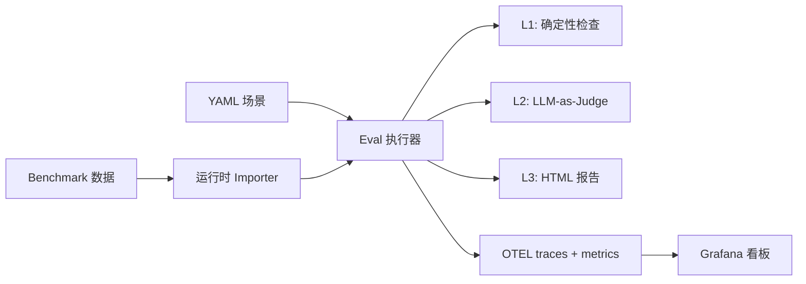

# AgentLens

[English](README.md) | [简体中文](README.zh-CN.md)

[](https://github.com/noCharger/agentlens/actions/workflows/ci.yml)
[](https://www.python.org/downloads/)
[](LICENSE)

像测试普通系统一样评测 AI Agent：先跑确定性检查，需要语义判断时再上评分模型，出问题了有完整 trace 可以调试。

AgentLens 是面向 LLM Agent 的评估与可观测性工具。本地直接跑，接 CI 也行，结果可以直接用于排查问题。

```
Scenario tc-001: Read File Content
  L1  tools: PASS  output: PASS  trajectory: PASS  safety: PASS
  L2  accuracy: 5/5 — "Output matches reference content exactly."
  ──────────────────────────────────────────────────────────────
  PASS
```

## 快速上手

```bash
# 环境准备
python3.11 -m venv .venv
source .venv/bin/activate
pip install -e ".[dev]"

# Dry run（不调用 LLM）
python -m agentlens.eval --dry-run

# 跑单个场景
python -m agentlens.eval --scenario-id tc-001

# 带 LLM-as-Judge 评分
python -m agentlens.eval --scenario-id tc-001 --level2

# 生成 HTML 报告
python -m agentlens.eval --level2 --output report.html
```

## 评估流程

每条场景最多经过三层：

| 层级 | 检查内容 | 成本 | 稳定性 |
|------|---------|------|--------|
| **L1** 确定性检查 | 工具调用、输出内容、轨迹、参数、终止行为、安全 | 零 LLM 调用 | 高 |
| **L2** LLM-as-Judge | 通过 rubric 和可选指标做语义质量评分 | 1+ 次 LLM 调用 | 中 |
| **L3** HTML 报告 | 可供人类审阅的汇总，含 explanation 和明细 | 零 LLM 调用 | — |

L1 拦住能提前定义的错误，L2 补足规则覆盖不到的质量问题，L3 让两者都可以被检查。

### L1：确定性检查

每条场景都会跑六项独立检查：

- **工具调用** — Agent 是否调用了预期工具？
- **输出格式** — 输出是否包含必要的子串？
- **轨迹** — 步数、循环检测、策略漂移、子任务切换
- **工具参数** — 工具调用时传的参数是否合法？
- **终止行为** — Agent 是否正确停止？
- **安全** — 是否违反安全约束？

每项检查独立产出 pass/fail 和结构化的 failure reasons，不需要任何 LLM 调用。

### L2：LLM-as-Judge 评分

启用 `--level2` 后，judge 模型会按照 rubric 和可选参考答案对 Agent 输出打分，基础 judge 输出 1–5 分和文字说明。

五个可选指标可以扩展基础 judge：

| 指标 | 检查内容 | 方法 |
|------|---------|------|
| `--geval` | Rubric 对齐程度 | 两阶段 CoT：先生成评估步骤，再按步骤打分（[G-Eval](https://arxiv.org/abs/2303.16634)） |
| `--task-completion` | 子任务覆盖率 | 把 query 拆成子任务，在轨迹里逐项核查 |
| `--answer-relevancy` | 陈述级别的相关性 | 把回答拆成 atomic statements，判断每条是否真正回答了问题（[FActScore](https://aclanthology.org/2023.emnlp-main.741/)） |
| `--hallucination` | 与 context 的矛盾 | 基于 NLI 检测与场景 context 或 trace 提取 context 的冲突（[CoNLI](https://arxiv.org/abs/2310.03951)） |
| `--faithfulness` | Context 支撑程度 | 核查每条声明是否有依据（[SAFE](https://arxiv.org/abs/2403.18802)） |

每个指标独立开关，随意组合：

```bash
# 只用基础 rubric
python -m agentlens.eval --level2

# G-Eval 替代基础 judge，做结构化两阶段评分
python -m agentlens.eval --level2 --geval

# 叠加特定指标
python -m agentlens.eval --level2 --geval --hallucination --faithfulness

# 全开
python -m agentlens.eval --level2 --all-metrics
```

所有指标都输出 `JudgeScore` 对象（维度、1–5 分、说明），自动走同一套报告、OTEL 导出和对比路径。

### L3：HTML 报告

传入 `--output report.html` 生成自包含报告：

- 汇总卡片：总数、通过、部分通过、有风险、失败、通过率
- 每条场景明细：L1 结果、L2 分数和说明、失败原因
- 运行 benchmark 套件时额外提供 benchmark 维度聚合

## 场景格式

场景是 `src/agentlens/scenarios/` 目录下的 YAML 文件：

```yaml
id: tc-001
name: "Read File Content"
category: tool_calling
input:
  query: "Read the file /tmp/agentlens_test/data.txt and tell me its contents"
  setup:
    - "mkdir -p /tmp/agentlens_test && echo 'hello agentlens' > /tmp/agentlens_test/data.txt"
expected:
  tools_called: ["read_file"]
  max_steps: 3
  output_contains: ["hello agentlens"]
judge_rubric: "accuracy"
reference_answer: "The file contains: hello agentlens"
```

| 字段 | 用途 |
|------|------|
| `input.query` | 发给 Agent 的 prompt |
| `input.setup` | Agent 启动前执行的 shell 命令 |
| `expected.tools_called` | L1：必须出现在 trace 里的工具 |
| `expected.output_contains` | L1：输出必须包含的子串 |
| `expected.max_steps` | L1：轨迹步数上限 |
| `judge_rubric` | L2：评分维度（`accuracy`、`task_completion`、`answer_relevancy` 等） |
| `reference_answer` | L2：提供给 judge 的参考答案 |
| `context` | L2（可选）：幻觉/faithfulness 检测用的 grounding 文档 |

没有 `judge_rubric` 的场景只跑 L1。加上 `context: [...]` 可为幻觉或 faithfulness 指标提供显式 grounding 内容。

## Feature Flag

每个 L2 指标都可以从 CLI 或 `.env` 独立开关：

| CLI 参数 | 环境变量 | 默认 |
|----------|---------|------|
| `--geval` | `JUDGE_USE_GEVAL` | 关 |
| `--task-completion` | `JUDGE_TASK_COMPLETION` | 关 |
| `--answer-relevancy` | `JUDGE_ANSWER_RELEVANCY` | 关 |
| `--hallucination` | `JUDGE_HALLUCINATION` | 关 |
| `--faithfulness` | `JUDGE_FAITHFULNESS` | 关 |
| `--all-metrics` | — | 关 |

CLI 和 config 采用 OR 逻辑。都不设置时，只跑基础 judge。

这套设计让消融实验很直接：用同一批场景、不同指标组合跑几次，对比 HTML 报告即可。

## 模型 Provider

Agent 和 Judge 都可以灵活选择 LLM provider：

```bash
# provider:模型名
AGENT_MODEL=gemini:gemini-2.5-flash
JUDGE_MODEL=gemini:gemini-2.5-flash-lite
```

| Provider | 前缀 | 示例 |
|----------|------|------|
| Gemini | `gemini:` | `gemini:gemini-2.5-flash` |
| DeepSeek | `deepseek:` | `deepseek:deepseek-chat` |
| OpenRouter | `openrouter:` | `openrouter:openai/gpt-4o-mini` |
| Zhipu (GLM) | `zhipu:` | `zhipu:glm-4-plus` |

可以随意混搭 — DeepSeek 跑 agent，Gemini 当 judge，反过来也行：

```bash
AGENT_MODEL=deepseek:deepseek-chat
JUDGE_MODEL=gemini:gemini-2.5-flash-lite
```

临时切换不改 `.env`，走 CLI 参数：

```bash
python -m agentlens.eval --scenario-id tc-001 \
  --agent-model openrouter:openai/gpt-4o-mini \
  --judge-model gemini:gemini-2.5-flash-lite
```

每个 provider 在开跑前都会验证 key 和额度，失败时早报错、给明确提示。

## Benchmark

AgentLens 在运行时从 `data/benchmarks/<slug>/` 动态加载 benchmark 数据。

### 支持的 Benchmark

| Benchmark | Slug | 评分方式 |
|-----------|------|---------|
| GDPval-AA | `gdpval-aa` | 内置（`--level2`） |
| SWE-Bench Pro | `swe-bench-pro` | 外部 harness |
| Multi-SWE Bench | `multi-swe-bench` | 外部 harness |
| Toolathlon | `toolathlon` | 外部 harness |
| VIBE-Pro | `vibe-pro` | 外部 harness |
| MLE-Bench Lite | `mle-bench-lite` | 外部 harness |
| MM-ClawBench | `mm-clawbench` | 外部 harness |
| Artificial Analysis | `artificial-analysis` | 外部 harness |

### Dataset Pipeline

构建版本化、可复现的 dataset：

```bash
# 构建 dataset version
python -m agentlens.dataset \
  --benchmark gdpval-aa \
  --name gdpval-regression \
  --output data/datasets/gdpval-regression-v1.json

# 基于 dataset version 运行 eval
python -m agentlens.eval \
  --dataset-version-file data/datasets/gdpval-regression-v1.json \
  --level2 --output gdpval.html
```

### Benchmark 沙箱

Benchmark 场景默认运行在沙箱里。非任务命令（`pip`、`curl`、`open`）会被拦截，除非 benchmark profile 显式放行。

按 benchmark 覆盖配置：`data/benchmarks/<slug>/sandbox_profile.json`

```json
{
  "allowed_commands": ["python", "python3", "pip", "ls", "cp", "mv"],
  "blocked_commands": ["curl", "wget", "open"],
  "required_python_modules": ["openpyxl", "pandas"]
}
```

### 下载 Benchmark 数据

```bash
# GDPval-AA
pip install -e ".[benchmarks]"
hf download openai/gdpval \
  --repo-type dataset --include "data/*.parquet" \
  --local-dir data/benchmarks/gdpval-aa

# Multi-SWE Bench
hf download bytedance-research/Multi-SWE-Bench \
  --repo-type dataset --include "*.jsonl" \
  --local-dir data/benchmarks/multi-swe-bench
```

## 可观测性

AgentLens 对每次运行都做 OpenTelemetry 埋点。collector 可用时你会获得：

- Agent run、工具调用、LLM 延迟指标
- Prometheus 中按维度聚合的 judge 分数
- Tempo 中的完整 trace，eval 状态挂在根 span 上
- 每条 trace 上的 feature flag 属性（`eval.flags.*`）

### 本地监控栈

```bash
docker compose up -d
```

| 服务 | 地址 |
|------|------|
| Grafana | [localhost:3001](http://localhost:3001)（admin / admin） |
| Prometheus | [localhost:9090](http://localhost:9090) |
| Tempo | [localhost:3200](http://localhost:3200) |
| OTEL Collector | gRPC :4317，HTTP :4318 |

Dashboard 面板涵盖：eval 结果分布、风险信号、失败模式、按维度的 judge 分数、LLM 延迟（按 provider）、trace 耗时分布。

没有 collector 时 eval runner 仍然可以正常运行，OTEL 部分会优雅降级。

## 配置项参考

最小 `.env`：

```bash
GOOGLE_API_KEY=your-key
AGENT_MODEL=gemini:gemini-2.5-flash
JUDGE_MODEL=gemini:gemini-2.5-flash-lite
```

完整 `.env.example` 在仓库里。常用配置项：

| 变量 | 用途 | 默认值 |
|------|------|--------|
| `AGENT_MODEL` | Agent 使用的模型 | — |
| `JUDGE_MODEL` | L2 评分使用的模型 | — |
| `AGENT_MAX_TOKENS` | Agent 输出 token 上限 | `2048` |
| `JUDGE_MAX_TOKENS` | Judge 输出 token 上限 | `512` |
| `AGENT_MAX_STEPS` | Agent 最大轨迹步数 | `10` |
| `OTEL_EXPORTER_OTLP_ENDPOINT` | Collector 地址 | `http://localhost:4317` |
| `OTEL_SERVICE_NAME` | Trace 中的服务名 | `agentlens` |

API key 只在选用对应 provider 时需要填写。

## 架构



```text
src/agentlens/
├── agents/              # Agent 创建、工具预设
├── eval/
│   ├── level1_deterministic/   # 6 个检查模块
│   ├── level2_llm_judge/       # Judge + 5 个可选指标
│   ├── level3_human/           # HTML 报告生成
│   ├── runner.py               # 编排层
│   └── scenarios.py            # YAML 加载 + 数据模型
├── core/                # 本地记录、告警、API
├── dataset/             # 版本化 dataset pipeline
├── observability/       # OTEL span + metrics
├── scenarios/           # 内置 YAML 场景
└── config.py            # pydantic-settings
```

## CLI 速查

```bash
# 场景操作
python -m agentlens.eval --dry-run                    # 不调用 LLM 验证场景
python -m agentlens.eval --list-benchmarks            # 查看可用 benchmark
python -m agentlens.eval --scenario-id tc-001         # 跑单条场景
python -m agentlens.eval --scenarios path/to/dir      # 从自定义目录加载

# 评估层级
python -m agentlens.eval                              # 只跑 L1
python -m agentlens.eval --level2                     # L1 + L2
python -m agentlens.eval --level2 --output report.html  # L1 + L2 + L3

# L2 指标选择
python -m agentlens.eval --level2 --geval
python -m agentlens.eval --level2 --task-completion --answer-relevancy
python -m agentlens.eval --level2 --all-metrics

# Benchmark 运行
python -m agentlens.eval --benchmark gdpval-aa --level2
python -m agentlens.eval --benchmark gdpval-aa --dry-run

# Dataset pipeline
python -m agentlens.dataset --benchmark gdpval-aa --name v1 --output dataset.json
python -m agentlens.eval --dataset-version-file dataset.json --level2

# 其他工具
python -m agentlens.eval.importers --list-benchmarks
python -m agentlens.core --help
```

## 开发

```bash
# 跑测试（380 个）
python -m pytest

# Lint
python -m ruff check src tests
```

## 参考文献

| 指标 | 论文 |
|------|------|
| G-Eval | [G-Eval: NLG Evaluation using GPT-4 with Better Human Alignment](https://arxiv.org/abs/2303.16634) |
| Answer Relevancy | [FActScore: Fine-grained Atomic Evaluation of Factual Precision](https://aclanthology.org/2023.emnlp-main.741/) |
| Hallucination | [CoNLI: Chain of Natural Language Inference for Reducing Hallucinations](https://arxiv.org/abs/2310.03951) |
| Faithfulness | [SAFE: Long-form Factuality in Large Language Models](https://arxiv.org/abs/2403.18802) |

其他参考：[SelfCheckGPT](https://arxiv.org/abs/2303.08896)、[TRUE](https://aclanthology.org/2022.naacl-main.287/)、[VeriScore](https://aclanthology.org/2024.findings-emnlp.552/)、[RAGAS](https://arxiv.org/abs/2309.15217)

## License

见 [LICENSE](LICENSE)。
