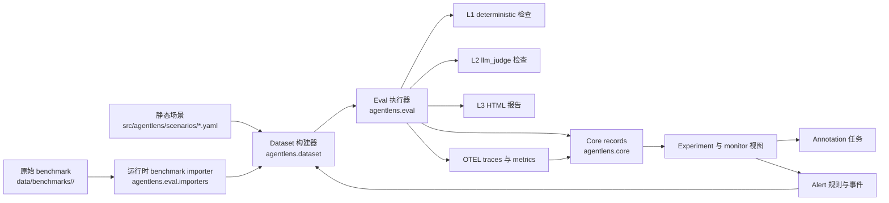

# AgentLens

[English](README.md) | [简体中文](README.zh-CN.md)

AgentLens 是一个用于评估 AI Agent 行为的轻量平台，包含四部分能力：

- 运行 agent：基于 LangGraph + LangChain 执行任务
- 模型选择：支持 Gemini、DeepSeek、OpenRouter、Zhipu，可分别选择 agent / judge 模型
- 评估结果：支持确定性规则检查、LLM-as-Judge 和 HTML 报告
- 观测数据：通过 OpenTelemetry 导出 trace 和 metrics

## OSS 范围

OSS 内包含：

- 本地/CI 可用的 SDK + CLI
- 运行时 benchmark adapter 与 dataset 构建 pipeline
- `deterministic` + `llm_judge` 评估能力与 HTML 报告
- OpenTelemetry 埋点与本地监控基础能力
- 本地 core 记录层（`src/agentlens/core/`）：file/sqlite 持久化、API/CLI 查询、告警规则评估

OSS 外（企业/私有）：

- 多租户控制面与工作空间隔离
- 企业身份体系（SSO、SCIM、细粒度 RBAC/ABAC）
- 合规编排（SOC2、HIPAA、GDPR、保留/法务冻结、合规报表）
- 托管 on-prem 打包内核、数据驻留策略运维、商业 SLA/计费/支持系统

## 系统架构



OSS core 可靠性原则：

- API/service 尽量无状态，状态统一落到 file/sqlite 持久层
- 快照写入支持 `idempotency_key`，便于失败重试且不重复落库
- 列表接口统一 `limit`/`offset`，控制内存占用和背压
- SQLite 默认走 `WAL`、`busy_timeout` 与指数退避重试，提升并发与容错
- 审计与告警事件使用确定性 ID，避免重试导致重复事件

核心包与职责：

- `src/agentlens/agents/`：运行时 agent 创建与工具预设
- `src/agentlens/model_selection.py` + `src/agentlens/llms.py`：provider/model 解析与模型客户端构建
- `src/agentlens/eval/`：运行时场景加载、benchmark importer、eval runner、L1/L2/L3 评估输出
- `src/agentlens/dataset/`：不可变 dataset version 构建与 dataset item 到运行时场景转换
- `src/agentlens/core/`：本地闭环记录层、file/sqlite repository、本地 API/CLI、告警评估与事件
- `src/agentlens/observability/`：OTEL 埋点、span 与指标
- `src/agentlens/scenarios/`：手写静态 YAML 场景

## 目录结构

```text
agentlens/
├── src/agentlens/
│   ├── agents/
│   ├── scenarios/               # 手写 YAML 场景
│   ├── eval/
│   │   ├── level1_deterministic/
│   │   ├── level2_llm_judge/
│   │   ├── level3_human/
│   │   ├── benchmarks.py
│   │   ├── importers.py
│   │   ├── runner.py
│   │   └── scenarios.py
│   ├── dataset/                 # dataset-version pipeline
│   ├── core/                    # 本地闭环记录与 API
│   └── observability/           # traces 与 metrics
├── data/
│   └── benchmarks/<slug>/       # 原始 benchmark 文件（运行时动态加载）
├── infra/
├── tests/
└── pyproject.toml
```

## 可观测性栈

本地启动监控组件：

```bash
docker compose up -d
```

近期更新：

- Grafana/Prometheus 的 LLM 指标改为 provider 通配匹配：
  `span_name=~"ChatGoogleGenerativeAI|ChatOpenAI|ChatDeepSeek|ChatAnthropic"`
- `agent.run` 现在是带 eval 语义的根 span：
  原始执行 trace 保留在同一条链路里，评估得到的语义信号会回写成 root span attributes/events 和 Prometheus metrics
- 新增面板：
  `Eval Outcome Mix`、`Risk Signals by Type`、`Failure Patterns`、`Judge Score by Dimension`，
  同时保留 `LLM Calls by Provider`、`LLM Latency by Provider`、`Trace Duration Distribution`、`Slowest Operations`
- `Recent Traces` 表格扩展为全宽，支持点击 Trace ID 跳转到 Grafana Explore 查看完整 trace
- Tempo datasource 启用了 `nodeGraph`、trace search、traces-to-metrics 关联
- OTEL Collector 增加了 `openinference.span.kind`、`eval.status`、`agent.benchmark` 等维度提取
- Prometheus 告警规则在 [`infra/prometheus-alerts.yml`](infra/prometheus-alerts.yml)，并通过 [`infra/prometheus.yml`](infra/prometheus.yml) 加载

PromQL/TraceQL 示例与告警说明见 [`infra/README.md`](infra/README.md)。

## 环境准备

要求：

- Python `3.11+`
- 建议在项目根目录使用本地虚拟环境 `.venv`

### 1. 创建 venv

```bash
python3.11 -m venv .venv
```

### 2. 激活 venv

`zsh` / `bash`:

```bash
source .venv/bin/activate
```

退出虚拟环境：

```bash
deactivate
```

### 3. 安装依赖

日常开发：

```bash
pip install -e ".[dev]"
```

如果要加载 parquet 或下载 benchmark 数据：

```bash
pip install -e ".[dev,benchmarks]"
```

`.[benchmarks]` 也会安装 `openpyxl`、`pandas`、`numpy`，GDPval 这类电子表格任务会用到它们。

## 环境变量

项目通过 `pydantic-settings` 从 `.env` 读取配置。最小示例：

```bash
GOOGLE_API_KEY=your_google_ai_studio_key
DEEPSEEK_API_KEY=your_deepseek_api_key
OPENROUTER_API_KEY=your_openrouter_api_key
ZHIPU_API_KEY=your_zhipu_api_key
DEEPSEEK_API_BASE=https://api.deepseek.com
OPENROUTER_API_BASE=https://openrouter.ai/api/v1
ZHIPU_API_BASE=https://open.bigmodel.cn/api/paas/v4
OPENROUTER_HTTP_REFERER=https://your-app.example
OPENROUTER_X_TITLE=AgentLens
AGENT_MODEL=gemini:gemini-2.5-flash
JUDGE_MODEL=gemini:gemini-2.5-flash-lite
AGENT_MAX_TOKENS=2048
JUDGE_MAX_TOKENS=512
OTEL_EXPORTER_OTLP_ENDPOINT=http://localhost:4317
OTEL_SERVICE_NAME=agentlens
AGENT_MAX_STEPS=10
```

说明：

- `GOOGLE_API_KEY` 只在选择 Gemini 模型时需要
- `DEEPSEEK_API_KEY` 只在选择 DeepSeek 模型时需要
- `OPENROUTER_API_KEY` 只在选择 OpenRouter 模型时需要
- `ZHIPU_API_KEY` 只在选择 Zhipu 模型时需要
- `JUDGE_MODEL` 只在 `--level2` 时使用
- `AGENT_MAX_TOKENS` 用于限制 Agent 输出 token（OpenRouter 低额度 key 很关键）
- `JUDGE_MAX_TOKENS` 用于限制 L2 judge 输出 token（OpenRouter 低额度 key 特别有用）
- `OPENROUTER_HTTP_REFERER` 和 `OPENROUTER_X_TITLE` 可选，但建议在 OpenRouter 请求里配置
- 没有 OTEL collector 也可以运行；系统会尽量优雅降级

## Model Select

`AGENT_MODEL` 和 `JUDGE_MODEL` 都支持两种写法：

- 显式 provider：`gemini:gemini-2.5-flash`
- 直接写模型名（例如 `deepseek-chat` 或 `glm-4-plus`）
- 带命名空间的模型名（例如 `openai/gpt-4o-mini`）会自动推断为 OpenRouter

推荐始终显式写 provider，这样更清楚，也更方便在多 provider 间切换。

常见例子：

```bash
AGENT_MODEL=gemini:gemini-2.5-flash
JUDGE_MODEL=gemini:gemini-2.5-flash-lite
```

```bash
AGENT_MODEL=deepseek:deepseek-chat
JUDGE_MODEL=deepseek:deepseek-chat
```

```bash
AGENT_MODEL=openrouter:openai/gpt-4o-mini
JUDGE_MODEL=openrouter:openai/gpt-4o-mini
```

```bash
AGENT_MODEL=zhipu:glm-4-plus
JUDGE_MODEL=zhipu:glm-4-plus
```

也可以混搭：

```bash
AGENT_MODEL=deepseek:deepseek-chat
JUDGE_MODEL=openrouter:openai/gpt-4o-mini
```

如果只是临时切换，不改 `.env`，也可以直接走 CLI override：

```bash
./.venv/bin/python -m agentlens.eval \
  --agent-model openrouter:openai/gpt-4o-mini \
  --judge-model openrouter:openai/gpt-4o-mini \
  --scenario-id tc-001
```

说明：

- `deepseek:deepseek-chat` 适合作为通用工具调用 agent 的默认选择
- judge 侧可以用 Gemini、DeepSeek、OpenRouter 或 Zhipu
- 如果选中了 DeepSeek，AgentLens 会在真正开跑前先做一次余额预检；余额不足时会直接提前报错
- 如果选中了 OpenRouter，AgentLens 会在开跑前做一次 key 预检；鉴权或额度异常会提前报错
- 如果选中了 Zhipu，AgentLens 会在开跑前校验 key/base-url 配置

## 本地开发命令

运行测试：

```bash
./.venv/bin/python -m pytest
```

跑 lint：

```bash
./.venv/bin/python -m ruff check src tests
```

查看 CLI 参数：

```bash
./.venv/bin/python -m agentlens.eval --help
./.venv/bin/python -m agentlens.eval.importers --help
./.venv/bin/python -m agentlens.dataset --help
./.venv/bin/python -m agentlens.core --help
./.venv/bin/python -m agentlens.core.api --help
```

## 运行内置 YAML 场景

列出当前可加载的 benchmark 和场景数量：

```bash
./.venv/bin/python -m agentlens.eval --list-benchmarks
```

只做 dry-run，不真正调用模型：

```bash
./.venv/bin/python -m agentlens.eval --dry-run
```

只跑单个场景：

```bash
./.venv/bin/python -m agentlens.eval --scenario-id tc-001
```

临时切到 DeepSeek 跑单个场景：

```bash
./.venv/bin/python -m agentlens.eval \
  --scenario-id tc-001 \
  --agent-model deepseek:deepseek-chat
```

生成 HTML 报告：

```bash
./.venv/bin/python -m agentlens.eval --output report.html
```

## Benchmark 运行方式

### 关键原则

- benchmark 原始文件放到 `data/benchmarks/<slug>/`
- AgentLens 运行时动态发现并加载这些文件
- 不再生成或依赖 `src/agentlens/scenarios/benchmarks/*.yaml`
- eval 现在支持基于 dataset version 的可复现执行路径

### 双 Pipeline 工作流

先从本地场景和 benchmark 数据构建 dataset version：

```bash
./.venv/bin/python -m agentlens.dataset \
  --benchmark gdpval-aa \
  --name gdpval-regression \
  --output data/datasets/gdpval-regression-v1.json
```

再基于 dataset version 文件运行 eval：

```bash
./.venv/bin/python -m agentlens.eval \
  --dataset-version-file data/datasets/gdpval-regression-v1.json \
  --level2 \
  --output gdpval.html
```

也可以基于已持久化的 dataset version id 运行：

```bash
./.venv/bin/python -m agentlens.eval \
  --dataset-version-id <dataset_version_id> \
  --platform-store .agentlens-platform \
  --platform-project-slug qa-project
```

兼容模式仍然可用：`agentlens.eval --benchmark ...` 会继续工作，runner 内部会先构建一个内存中的 dataset version 再执行。
当同时传入 `--platform-store` 或 `--platform-sqlite` 时，这条兼容路径会使用确定性的 dataset fingerprint，复用同一个 dataset version id，避免重复生成。
（`--platform-*` 参数目前保留为向后兼容命名；OSS 模块命名已经切换到 `agentlens.core`。）

### 支持的 benchmark

| Benchmark | slug | 期望输入 | 默认评估模式 | 内置 runner 是否能直接评分 |
| --- | --- | --- | --- | --- |
| SWE Bench Pro | `swe-bench-pro` | `data/*.parquet` | `external` | 否，需要外部 harness |
| Multi-SWE Bench | `multi-swe-bench` | `**/*.jsonl` | `external` | 否，需要外部 harness |
| GDPval-AA | `gdpval-aa` | `data/*.parquet` 或 records 文件 | `llm_judge` | 可以，需加 `--level2` |
| Toolathlon | `toolathlon` | 任务目录 | `external` | 否，需要外部 harness |
| VIBE-Pro | `vibe-pro` | manifest | `external` | 通常需要外部 harness |
| MLE-Bench lite | `mle-bench-lite` | manifest | `external` | 通常需要外部 harness |
| MM-ClawBench | `mm-clawbench` | manifest | `external` | 通常需要外部 harness |
| Artificial Analysis | `artificial-analysis` | manifest | `external` | 取决于 manifest |

评估模式说明：

- `deterministic`
  只看工具调用、输出内容、轨迹等规则。
- `llm_judge`
  需要 `--level2`，使用 rubric 和参考答案做评分。
- `external`
  AgentLens 可以加载、筛选、列出和出报告，但不会把它误判成 PASS；真正评分要接外部 benchmark harness。

### Benchmark 沙箱（默认启用）

Benchmark 场景现在默认走沙箱策略（不是可选项）：

- `prepare` 阶段（harness 控制）：检查必需 Python 依赖和 benchmark 参考文件是否就绪。
- `run` 阶段（agent 控制）：按 benchmark 能力配置校验 shell 命令。

在 agent 运行期间，`pip`、`curl`、GUI `open` 等非任务命令会被拦截，除非该 benchmark 配置显式放行。

你也可以按 benchmark 覆盖能力配置：

`data/benchmarks/<benchmark-slug>/sandbox_profile.json`

示例：

```json
{
  "allowed_commands": ["python", "python3", "pip", "ls", "cp", "mv"],
  "blocked_commands": ["curl", "wget", "open"],
  "required_python_modules": ["openpyxl", "pandas"],
  "extra_allowed_roots": ["workdir"]
}
```

### Benchmark 数据放置约定

示例目录：

```text
data/benchmarks/
├── gdpval-aa/
│   └── data/
│       └── train-00000-of-00001.parquet
├── multi-swe-bench/
│   ├── python/
│   │   └── multi_swe_bench_python.jsonl
│   └── rust/
│       └── tokio-rs__tokio_dataset.jsonl
└── swe-bench-pro/
    └── data/
        └── test-00000-of-00001.parquet
```

### 预览 benchmark 会被映射成什么场景

先看 adapter 支持列表：

```bash
./.venv/bin/python -m agentlens.eval.importers --list-benchmarks
```

预览某个 records 风格 benchmark 文件：

```bash
./.venv/bin/python -m agentlens.eval.importers \
  --benchmark gdpval-aa \
  --input data/benchmarks/gdpval-aa/data/train-00000-of-00001.parquet \
  --limit 3
```

预览目录型 benchmark：

```bash
./.venv/bin/python -m agentlens.eval.importers \
  --benchmark multi-swe-bench \
  --input data/benchmarks/multi-swe-bench \
  --limit 3
```

### 运行 benchmark

1. 先确认 AgentLens 已经能发现 benchmark：

```bash
./.venv/bin/python -m agentlens.eval --list-benchmarks
```

2. 只看会加载哪些任务：

```bash
./.venv/bin/python -m agentlens.eval --benchmark gdpval-aa --dry-run
```

3. 真正运行可由内置 runner 评分的 benchmark：

```bash
./.venv/bin/python -m agentlens.eval --benchmark gdpval-aa --level2 --output gdpval.html
```

4. 对 `external` 类型 benchmark，先用 dry-run / inventory 模式：

```bash
./.venv/bin/python -m agentlens.eval --benchmark swe-bench-pro --dry-run
./.venv/bin/python -m agentlens.eval --benchmark multi-swe-bench --dry-run
```

如果 benchmark 数据放在别的位置，也可以显式传入：

```bash
./.venv/bin/python -m agentlens.eval \
  --benchmark gdpval-aa \
  --benchmark-data-root /absolute/path/to/benchmarks \
  --dry-run
```

## 用 Hugging Face CLI 下载 benchmark 数据

如果已经安装了 benchmark extra，并且系统里有 `hf` 命令，可以直接下载到 AgentLens 期望的目录布局。

GDPval-AA 示例：

```bash
./.venv/bin/hf download openai/gdpval \
  --repo-type dataset \
  --include "data/*.parquet" \
  --local-dir data/benchmarks/gdpval-aa
```

Multi-SWE Bench 示例：

```bash
./.venv/bin/hf download bytedance-research/Multi-SWE-Bench \
  --repo-type dataset \
  --include "*.jsonl" \
  --local-dir data/benchmarks/multi-swe-bench
```

对于其他 benchmark，只要最终文件布局满足 adapter 约定，用 Hugging Face CLI、`curl` 或你自己的同步脚本都可以。

## 报告与观测

命令行会输出：

- 每条场景的 PASS / FAIL
- benchmark 维度汇总
- 错误原因

如果传 `--output report.html`，会生成包含以下信息的 HTML：

- 总体 pass rate
- benchmark summary
- 每条场景的 L1 / L2 细节

如果 OTEL collector 可用，还会导出：

- agent run metrics
- tool call metrics
- LLM token / latency metrics

## 常见问题

### 1. 运行 benchmark 时提示需要 external harness

这是预期行为。像 `swe-bench-pro`、`multi-swe-bench` 这类 benchmark 的正确评分依赖它们自己的外部评测流程。AgentLens 当前负责：

- 动态加载任务
- 做 inventory / filtering
- 统一报告
- 避免把这些任务误判成 PASS

### 2. GDPval-AA 为什么一定要 `--level2`

因为它的主要评分信号来自 rubric 文本和参考答案，属于 `llm_judge` 模式。

### 3. macOS 下 `pyarrow` 打印 `sysctlbyname failed`

在受限环境里这是常见警告，通常不影响 parquet 读取。
